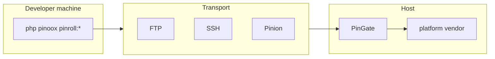

# Pinroll — Release Rollout Engine

[← Back to index](../README.md)

> **How to use it:** [Quick start](../start/pinroll-quickstart.md) · [Deploy → Pinroll](../deploy/pinroll.md)

**Pinroll** (`pinoox/pinroll`) builds releases, ships them to **hosts**, and installs them via **PinGate**. It is a Composer library; commands register on install.

Install as **dev** (`composer require --dev pinoox/pinroll`). The host does not need Pinroll in `vendor/` — `pingate.php` uses pincore.

| Concept | Meaning |
|---------|---------|
| **Host** | Deploy destination (`production`, …) — config key is the name |
| **`via`** | Transport: `ftp`, `ssh`, `pinion`, `local` |
| **PinGate** | Host HTTP API: one file `pingate.php` (`?route=`) |
| **Bundle** | Optional build recipe (`--bundle=…`) |

---

## Why Pinroll?

| Problem | Solution |
|---------|----------|
| Manual FTP deploys | Scripted push + PinGate install |
| Half-deployed sites | Atomic install + rollback |
| Shared hosting without SSH | FTP upload + remote install over HTTP |
| Empty host, no site yet | `pinroll:provision` (PinGate + platform.zip + installer setup) |
| Schema after deploy | `pinroll:setup` (migrate + patch; optional `--seed`) |
| Core / vendor updates on host | `pinroll:vendor --push` |

---

## Architecture



| Layer | Location |
|-------|----------|
| Engine | `pinoox/pinroll` |
| Canonical config | library `config/pinroll.php` |
| Project overlay | `.pinoox/pinroll.config.php` (gitignored) |
| PinGate entry | `{deploy_path}/pingate.php` |
| Runtime | `storage/pinroll/` |
| Local build artifacts | `apps/{package}/pinx/export/` |

---

## Common commands

```bash
php pinoox pinroll:init
php pinoox pinroll:provision           # blank host
php pinoox pinroll:connect             # existing site
php pinoox pinroll:config              # resolved host (token redacted)
php pinoox pinroll:deploy --full       # platform + every app
php pinoox pinroll:setup               # migrate + patch
php pinoox pinroll:rollback
```

---

## Related docs

- [Pinroll quick start](../start/pinroll-quickstart.md)
- [Pinroll deploy guide](../deploy/pinroll.md) — scenarios + full reference
- [Pinion](./pinion.md) — chunked HTTP upload
- [CLI reference](../start/cli-reference.md)

---

[← Back to index](../README.md)
