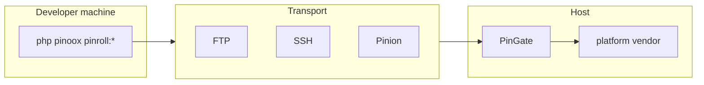

# Pinroll — Release Rollout Engine

[← Back to index](../README.md)

> **Full guide:** [Deploy → Pinroll](../deploy/pinroll.md) (hosts, connect, apps, retention, rollback).

**Pinroll** (`pinoox/pinroll`) builds releases, ships them to **hosts**, and installs them via **PinGate**. It is a Composer library; commands register on install.

| Concept | Meaning |
|---------|---------|
| **Host** | Deploy destination (`production`, …) — config key is the name |
| **`via`** | Transport: `ftp`, `ssh`, `pinion`, `local` |
| **PinGate** | Host HTTP API: `pingate.php` + `gate/` |
| **Bundle** | Optional build recipe (`--bundle=…`) |

---

## Why Pinroll?

| Problem | Solution |
|---------|----------|
| Manual FTP deploys | Scripted push + PinGate install |
| Half-deployed sites | Atomic install + rollback |
| Shared hosting without SSH | FTP upload + remote install over HTTP |
| Core / vendor updates on host | `pinroll:vendor` → replace host `vendor/` |

---

## Architecture



| Layer | Location |
|-------|----------|
| Engine | `pinoox/pinroll` |
| Project config | `pinroll/pinroll.config.php` |
| PinGate entry | `{deploy_path}/pingate.php` |
| PinGate app | `{deploy_path}/gate/` |
| Runtime | `storage/pinroll/` |
| Local build artifacts | `apps/{package}/pinx/export/` |

---

## Essential commands

```bash
php pinoox pinroll:init
php pinoox pinroll:connect              # setup once; later verifies
php pinoox pinroll:apps --apps=com_pinoox_shop
php pinoox pinroll:vendor               # export vendor.zip (install / update core)
php pinoox pinroll:check
php pinoox pinroll:push                 # build & upload only
php pinoox pinroll:install              # install staged release on host
php pinoox pinroll:deploy               # push + install (uses default_host + apps[])
php pinoox pinroll:rollback
php pinoox pinroll:cleanup --local
php pinoox pinroll:cleanup --dry-run
```

---

## Pinroll settings

```php
'default_host' => 'production',
'keep' => 2,
'store' => 'both',       // local | remote | both
'auto_clean' => true,    // prune remote incoming + local incoming/pinx export

'hosts' => [
    'production' => [
        'deploy_path' => 'public_html',
        'via' => 'ftp',
        'apps' => ['com_pinoox_shop'],
        'gate' => [
            'url' => env('PINROLL_PRODUCTION_URL', ''),
            'token' => env('PINROLL_PRODUCTION_TOKEN', ''),
        ],
        'ftp' => [
            'host' => env('PINROLL_PRODUCTION_HOST', ''),
            'user' => env('PINROLL_PRODUCTION_USER', ''),
            'password' => env('PINROLL_PRODUCTION_PASSWORD', ''),
        ],
    ],
],
```

```env
PINROLL_PRODUCTION_URL=https://example.com/pingate.php?route=
PINROLL_PRODUCTION_TOKEN=…
PINROLL_PRODUCTION_HOST=ftp.example.com
```

---

## Related docs

- [Pinroll deploy guide](../deploy/pinroll.md) — complete workflow
- [Pinion](./pinion.md) — chunked HTTP upload
- [CLI reference](../start/cli-reference.md)

---

[← Back to index](../README.md)
