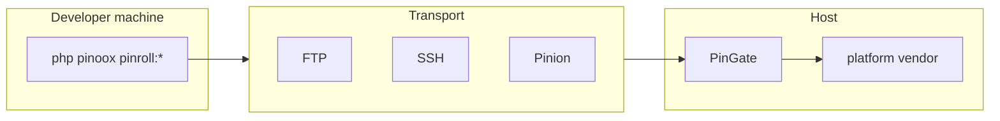

# Pinroll — Release Rollout Engine

[← Back to index](../README.md)

> **Full guide:** [Deploy → Pinroll](../deploy/pinroll.md) (setup, vendor export, FTP PinGate, push `-a`, CLI).

**Pinroll** (`pinoox/pinroll`) builds releases, ships them to targets, and applies them via **PinGate**. It is a Composer library; commands register on install.

| Concept | Meaning |
|---------|---------|
| **Target** | Deploy destination (`production`, …) |
| **`via`** | Transport: `ftp`, `ssh`, `pinion`, `local` |
| **PinGate** | Host HTTP API: `pingate.php` + `gate/` |
| **Bundle** | Optional build recipe |

---

## Why Pinroll?

| Problem | Solution |
|---------|----------|
| Manual FTP deploys | Scripted push + PinGate apply |
| Half-deployed sites | Atomic apply + rollback |
| Shared hosting without SSH | FTP upload + remote apply over HTTP |
| Core / vendor updates on host | `pinroll:vendor` → replace host `vendor/` |

---

## Architecture



| Layer | Location |
|-------|----------|
| Engine | `pinoox/pinroll` |
| Project config | `pinroll/pinroll.config.php` |
| PinGate entry | `{deploy-root}/pingate.php` |
| PinGate app | `{deploy-root}/gate/` |
| Runtime | `storage/pinroll/` |

---

## Essential commands

```bash
php pinoox pinroll:init -w
php pinoox pinroll:vendor               # export vendor.zip (install / update core)
php pinoox pinroll:gate                 # FTP upload PinGate (default; no zip)
php pinoox pinroll:check production
php pinoox pinroll:deploy production --package=com_pinoox_shop
php pinoox pinroll:rollback production
php pinoox pinroll:cleanup production --dry-run
```

`pinroll:vendor:pack` remains an alias of `pinroll:vendor`. `pinroll:gate:init` remains an alias of `pinroll:gate`.

---

## Target shape (current)

```php
'production' => [
    'dir' => 'public_html',
    'via' => 'ftp',
    'gate' => [
        'url' => env('PINROLL_PRODUCTION_URL', ''),
        'token' => env('PINROLL_PRODUCTION_TOKEN', ''),
    ],
    'ftp' => [
        'host' => env('PINROLL_PRODUCTION_HOST', ''),
        'user' => env('PINROLL_PRODUCTION_USER', ''),
        'password' => env('PINROLL_PRODUCTION_PASSWORD', ''),
    ],
],
```

```env
PINROLL_PRODUCTION_URL=https://pinoox.com/pingate.php?route=
PINROLL_PRODUCTION_TOKEN=…
PINROLL_PRODUCTION_HOST=ftp.pinoox.com
```

---

## Related docs

- [Pinroll deploy guide](../deploy/pinroll.md) — complete workflow
- [Pinion](./pinion.md) — chunked HTTP upload
- [CLI reference](../start/cli-reference.md)

---

[← Back to index](../README.md)
