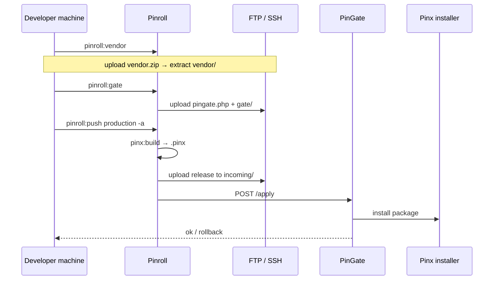

# Pinroll — Release & Deploy

[← Back to index](../README.md)

**Pinroll** (`pinoox/pinroll`) is the official Pinoox release rollout engine. It builds app packages, ships them to remote servers, applies them atomically via **PinGate**, and supports rollback and cleanup.

Pinroll is a **Composer library** — not a Pinoox app. CLI commands register automatically when the package is installed.

| Concept | Meaning |
|---------|---------|
| **Target** | Where to deploy (`production`, …) |
| **Transport (`via`)** | How to send files (`ftp`, `ssh`, `pinion`, `local`) |
| **PinGate** | HTTP entry on the host (`pingate.php` + `gate/`) for apply / status / rollback |
| **Bundle** | Optional build recipe (`single-app`, `platform-full`, …) |

> **Typical shared-hosting flow:** configure FTP + gate → `pinroll:vendor` (core/deps) → `pinroll:gate` → `pinroll:push -a`.

---

## Install

On a full Pinoox **platform** project:

```bash
composer require pinoox/pinion pinoox/pinroll
```

For local development with a sibling checkout:

```json
"repositories": [
  { "type": "path", "url": "../pinroll", "options": { "symlink": true } }
],
"require": {
  "pinoox/pinroll": "@dev"
}
```

---

## Project setup

```bash
php pinoox pinroll:init
php pinoox pinroll:init -w   # interactive wizard (FTP, dir, PinGate)
```

This scaffolds at the project root:

```
pinroll/
  pinroll.config.php
  bundles/
    single-app.php
    platform-core.php
    platform-full.php
    test-empty.php
```

Keep secrets in `.env`. Add `pinroll/` to `.gitignore` if it holds local deploy artifacts.

---

## Configuration

### Targets (`pinroll/pinroll.config.php`)

Modern targets use **`via`**, a top-level **`gate`** block, and transport credentials under `ftp` / `ssh` / `pinion`:

```php
<?php

return [
    'targets' => [
        'production' => [
            // Path relative to FTP/SSH login (site at domain root → public_html)
            'dir' => 'public_html',
            'via' => 'ftp',

            'gate' => [
                'url' => env('PINROLL_PRODUCTION_URL', ''),
                'token' => env('PINROLL_PRODUCTION_TOKEN', ''),
            ],

            'ftp' => [
                'host' => env('PINROLL_PRODUCTION_HOST', ''),
                'user' => env('PINROLL_PRODUCTION_USER', ''),
                'password' => env('PINROLL_PRODUCTION_PASSWORD', ''),
            ],

            // Optional: limit which apps push by default
            'apps' => [
                'com_pinoox_shop',
            ],
        ],
    ],
];
```

| Key | Description |
|-----|-------------|
| `dir` | Deploy root relative to FTP/SSH login. Site at domain root: `public_html`. Subfolder site: e.g. `public_html/shop`. Empty = login root. |
| `via` | Default transport: `ftp`, `ssh`, `pinion`, or `local` |
| `gate.url` / `gate.token` | PinGate credentials (shared for apply / pinion) |
| `ftp` / `ssh` / `pinion` | Connection credentials only (no nested `gate`) |
| `apps` | Optional list of packages for push |
| `bundle` / `package` | Optional defaults for recipe-based builds |

### `.env` keys

```env
PINROLL_PRODUCTION_URL=https://pinoox.com/pingate.php?route=
PINROLL_PRODUCTION_TOKEN=…
PINROLL_PRODUCTION_HOST=ftp.pinoox.com
PINROLL_PRODUCTION_USER=…
PINROLL_PRODUCTION_PASSWORD=…
```

`pinroll:gate` writes URL + token into `.env` automatically.

### Bundles (`pinroll/bundles/*.php`)

Optional recipes for `pinroll:build` / legacy bundle deploys. Day-to-day app deploys usually use `pinroll:push` with `--package=` or target `apps[]`.

---

## Quick start (FTP + PinGate)

### 1. Init & configure

```bash
php pinoox pinroll:init -w
```

Or edit `pinroll/pinroll.config.php` and `.env` manually.

### 2. Export platform vendor (core + dependencies)

`pinroll:vendor` zips the full local Composer `vendor/` tree for the host. Use it to:

- **First install** — put a complete `vendor/` next to `pingate.php`
- **Update Pinoox core / Packagist deps** — after `composer update` locally, re-export and replace host `vendor/`
- **Ship path-repos** — local checkouts (`../pincore3`, `../pinroll`, …) are followed into real files inside the zip

```bash
php pinoox pinroll:vendor
# aliases: pinroll:vendor:pack, pinroll:pack:vendor
```

Output: `pinroll/vendor.zip`. Upload and extract into the deploy root so `vendor/` sits next to `pingate.php`. When updating core, **replace** the previous `vendor/` on the host.

Do not upload a local `.pincore` that points at `../pincore3` — on the host, core must come from `vendor/pinoox/pincore`.

### 3. Install PinGate on the host

With FTP configured, this builds PinGate and **uploads it over FTP**, then removes local gate files (no zip by default):

```bash
php pinoox pinroll:gate
```

| Option | Meaning |
|--------|---------|
| (default) | Build → FTP upload `pingate.php` + `gate/` → delete local artifacts |
| `-z` / `--zip` | Also build `pinroll/deploy-{target}.zip` for manual upload |
| `--no-upload` | Keep files under `pinroll/` (no FTP) |
| `--rotate` | Mint a new token (default: reuse `PINROLL_*_TOKEN` from `.env`) |

Alias: `pinroll:gate:init` still works.

### 4. Check & push

```bash
php pinoox pinroll:check production
php pinoox pinroll:push production -a --package=com_pinoox_shop
```

`-a` uploads then **applies remotely** via PinGate.

---

## PinGate layout on the host

Files live **next to the platform** (same folder as `vendor/`):

```
{deploy-root}/          # e.g. public_html/
  pingate.php
  gate/
    index.php
    bootstrap.php
    pingate.php
    vendor/
  vendor/               # from pinroll:vendor
  apps/
  …
```

Public URL when the site is at the domain root:

```
https://pinoox.com/pingate.php?route=
```

### `.htaccess` (only if `pinroll:check` returns HTML)

Paste **before** the front-controller rule:

```apache
RewriteRule ^pingate\.php$ - [L]
RewriteRule ^gate/ - [L]
```

### PinGate routes

| Method | Path | Purpose |
|--------|------|---------|
| `GET` | `/status` | Health / version |
| `GET` | `/incoming` | List staged releases |
| `POST` | `/apply` | Apply staged release |
| `POST` | `/rollback` | Re-apply previous release |
| `POST` | `/cleanup` | Prune old archives |
| `POST` | `/push/init` | Start chunked upload (Pinion) |
| `POST` | `/push/upload` | Upload chunk |
| `POST` | `/push/complete` | Finish upload |
| `GET` | `/history` | Rollout history |

Auth: `Authorization: Bearer {token}`.

---

## CLI reference

| Command | Alias | Purpose |
|---------|-------|---------|
| `pinroll:init` | — | Scaffold config; `-w` wizard |
| `pinroll:vendor` | `pinroll:vendor:pack`, `pinroll:pack:vendor` | Export `vendor/` for host install or core update → `pinroll/vendor.zip` |
| `pinroll:gate` | `pinroll:gate:init` | Build PinGate; FTP upload by default (`-z`, `--no-upload`, `--rotate`) |
| `pinroll:gate:token` | — | Print token / gate snippet (`--deploy` runs gate) |
| `pinroll:check` | — | Verify target / PinGate |
| `pinroll:push` | `pinroll:deploy`, `pinroll:prod` | Build & push (`-a` apply via PinGate) |
| `pinroll:apply` | — | Apply staged release on target (or `--local` on host) |
| `pinroll:rollback` | — | Rollback via PinGate |
| `pinroll:cleanup` | `pinroll:prune` | Prune old archives (`--dry-run`, `-k`) |
| `pinroll:build` | — | Build only |
| `pinroll:status` | — | Rollout status |
| `pinroll:history` | — | History |
| `pinroll:pull` | `pinroll:poll` | Pull manifest from release server |
| `pinroll:publish` | — | Publish manifest |
| `pinroll:migrate:dry-run` | — | Pending migrations preview |

### Common examples

```bash
php pinoox pinroll:vendor
php pinoox pinroll:gate
php pinoox pinroll:gate -z
php pinoox pinroll:gate --rotate

php pinoox pinroll:check production
php pinoox pinroll:push production -a --package=com_pinoox_shop
php pinoox pinroll:apply production
php pinoox pinroll:rollback production
php pinoox pinroll:cleanup production --dry-run
```

### Push options

```bash
php pinoox pinroll:push production -a \
  --package=com_pinoox_shop
```

| Option | Description |
|--------|-------------|
| `-a` / `--apply` | Apply on remote via PinGate after upload |
| `--package=` | App package to build/push |
| `--bundle=` | Bundle recipe override |
| `--via=` / `--transport=` | Override transport |

---

## Transports

| `via` | Use case |
|-------|----------|
| `ftp` | Shared hosting / cPanel — upload files; apply via PinGate |
| `ssh` | VPS — upload/apply over SSH |
| `pinion` | Chunked HTTP upload through PinGate |
| `local` | Same machine / smoke tests |

With **FTP**, PinGate is required for remote `apply` / `push -a`. `pinroll:gate` uploads the bootstrap over the same FTP connection.

---

## Rollout flow



---

## Storage layout

| Path | Purpose |
|------|---------|
| `storage/pinroll/releases/` | Built archives (local) |
| `storage/pinroll/incoming/` | Staged releases (host / local) |
| `storage/pinroll/sessions/` | Rollout sessions |
| `storage/pinroll/history.jsonl` | History log |

---

## Related docs

- [Pinion protocol](../advanced/pinion.md) — chunked upload
- [Pinx CLI](../start/pinx-cli.md) — `pinx:build`
- [CLI reference](../start/cli-reference.md)

---

[← Back to index](../README.md)
