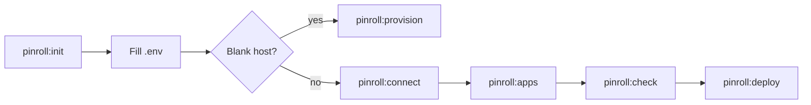
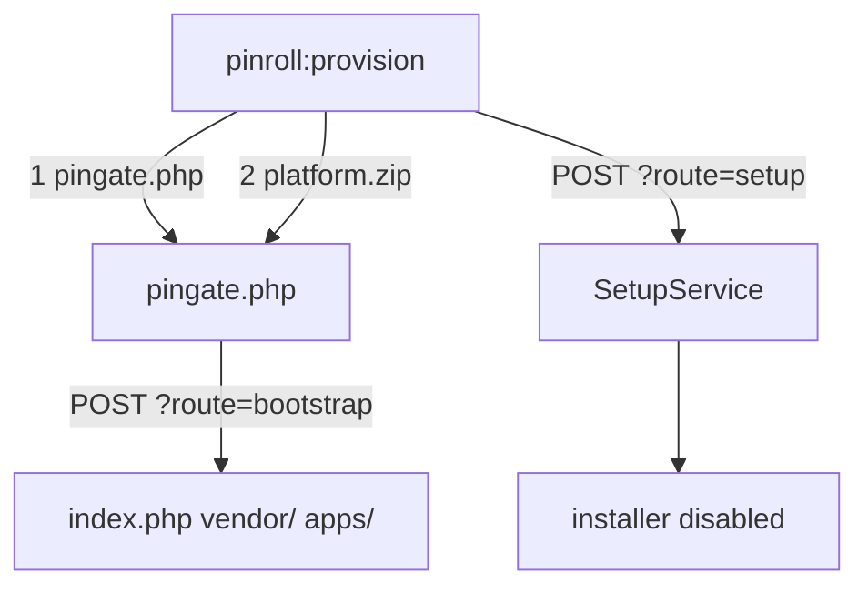

# Pinroll — Release & Deploy

[← Back to index](../README.md)

**Pinroll** (`pinoox/pinroll`) is the official Pinoox release rollout engine. It builds app packages, ships them to remote **hosts**, installs them via **PinGate**, and supports rollback, hooks, and retention.

Pinroll is a **Composer library** — not a Pinoox app. CLI commands register automatically when the package is installed.


| Concept | Meaning |
|---------|---------|
| **Host** | Where to deploy (`production`, `staging`, …) — the config key is the name |
| **Transport (`via`)** | How to send files (`ftp`, `ssh`, `pinion`, `local`) |
| **PinGate** | One public file on the host (`pingate.php`) for install / status / rollback / vendor extract / first-time provision |
| **Bundle** | Optional build recipe (`--bundle=…`); normal deploys auto-detect apps |

---

## Install

On a full Pinoox **platform** project, add Pinroll on the **dev machine** (recommended as `require-dev`):

```bash
composer require --dev pinoox/pinroll
```

The host does **not** need Pinroll in `vendor/`. `pingate.php` installs packages with pincore (`pinx:install` / `pinx:update`) and Pinion. Put Pinroll in `require` only if you want PinGate to use Pinroll classes on the server.

On a single-app (Pinx) project:

```bash
composer require --dev pinoox/pinroll
pinx deploy
pinx provision   # blank host
```

---

## Setup process



| Step | Command | What it does |
|------|---------|--------------|
| 1 | `php pinoox pinroll:init` | Creates `.pinoox/pinroll.config.php` + `.env` stubs |
| 2 | Edit `.env` | Set `PINROLL_*` FTP/SSH and (for a blank host) `PINROLL_DB_*` / `PINROLL_ADMIN_*` |
| 3a | `php pinoox pinroll:provision` | **Blank host:** upload PinGate + platform zip, then installer setup |
| 3b | `php pinoox pinroll:connect` | **Existing site:** deploy path, site URL, upload PinGate |
| 4 | `php pinoox pinroll:apps` | Choose default app packages for later deploys |
| 5 | `php pinoox pinroll:check` | Verify transport + PinGate |
| 6 | `php pinoox pinroll:deploy` | Build, upload, and install (go live) |
| 6b | `php pinoox pinroll:deploy --full` | Update **platform + every installed app** |

```bash
php pinoox pinroll:init
# fill PINROLL_* in .env
php pinoox pinroll:provision   # first time on an empty FTP folder
# later updates:
php pinoox pinroll:deploy --full
```

---

## Project setup

```bash
php pinoox pinroll:init
```

Scaffolds:

```
.pinoox/
  pinroll.config.php
```

Legacy path `pinroll/pinroll.config.php` still loads if present. Build recipes are auto-detected from `apps/` (no `pinroll/bundles/*.php` required for normal app deploy). Optional custom recipes: `pinroll/bundles/{name}.php` with `--bundle={name}`.

---


## Configuration


### Hosts (`.pinoox/pinroll.config.php`)

```php
<?php

return [
    // Used when CLI omits the host argument
    'default_host' => 'production',

    // Global defaults — inherited by every host unless overridden
    'keep' => 2,
    'store' => 'both',      // local | remote | both
    'auto_clean' => true,   // prune beyond keep after successful install

    'lang' => env('PINROLL_LANG', 'en'),

    'provision' => [
        'db' => [
            'host' => env('PINROLL_DB_HOST', 'localhost'),
            'database' => env('PINROLL_DB_DATABASE', 'pinoox'),
            'username' => env('PINROLL_DB_USERNAME', ''),
            'password' => env('PINROLL_DB_PASSWORD', ''),
            'connection' => env('PINROLL_DB_CONNECTION', 'mysql'),
            'port' => env('PINROLL_DB_PORT', '3306'),
            'prefix' => env('PINROLL_DB_PREFIX', 'pin_'),
            'timezone' => env('PINROLL_DB_TIMEZONE', '+03:30'),
        ],
        'user' => [
            'fname' => env('PINROLL_ADMIN_FNAME', ''),
            'lname' => env('PINROLL_ADMIN_LNAME', ''),
            'email' => env('PINROLL_ADMIN_EMAIL', ''),
            'username' => env('PINROLL_ADMIN_USERNAME', ''),
            'password' => env('PINROLL_ADMIN_PASSWORD', ''),
        ],
    ],

    // Extra platform zip rules (merged with platform/build.config.php)
    'build' => [
        'exclude' => [],
        'include' => [],
    ],

    'hosts' => [
        'production' => [
            'deploy_path' => 'public_html',
            'via' => 'ftp',

            // Default packages for push/install (or use pinroll:apps)
            'apps' => ['com_pinoox_shop'],

            'gate' => [
                'url' => env('PINROLL_PRODUCTION_URL', ''),
                'token' => env('PINROLL_PRODUCTION_TOKEN', ''),
            ],

            'ftp' => [
                'host' => env('PINROLL_PRODUCTION_HOST', ''),
                'user' => env('PINROLL_PRODUCTION_USER', ''),
                'password' => env('PINROLL_PRODUCTION_PASSWORD', ''),
            ],

            'hooks' => [
                'before_install' => ['php pinoox migrate --force'],
                'after_install' => ['php pinoox cache:build'],
            ],
        ],
    ],
];
```


| Key                             | Description                                                     |
| ------------------------------- | --------------------------------------------------------------- |
| `default_host`                  | Host used when CLI omits the host name                          |
| `deploy_path`                   | Deploy root relative to FTP/SSH login                           |
| `hostname`                      | Optional connection address when it differs from transport host |
| `via`                           | Default transport: `ftp`, `ssh`, `pinion`, or `local`           |
| `gate.url` / `gate.token`       | PinGate credentials                                             |
| `ftp` / `ssh`                   | Connection credentials                                          |
| `apps`                          | Default app packages for push/install                           |
| `hooks`                         | Shell commands around push, install, rollback                   |
| `keep` / `store` / `auto_clean` | Retention (global or per-host)                                  |


### `.env` keys

Production also reads **unscoped** keys (`PINROLL_VIA`, `PINROLL_DB_HOST`, …). Other host names use `PINROLL_{HOST}_*` (example: `PINROLL_STAGING_URL`).

```env
PINROLL_VIA=ftp
PINROLL_PATH=public_html
PINROLL_URL=https://example.com/pingate.php?route=
PINROLL_TOKEN=…
PINROLL_HOST=ftp.example.com
PINROLL_USER=…
PINROLL_PASSWORD=…

# First-time provision (same fields as the web installer)
PINROLL_LANG=en
PINROLL_DB_HOST=localhost
PINROLL_DB_DATABASE=pinoox
PINROLL_DB_USERNAME=…
PINROLL_DB_PASSWORD=…
PINROLL_DB_CONNECTION=mysql
PINROLL_DB_PORT=3306
PINROLL_DB_PREFIX=pin_
PINROLL_DB_TIMEZONE=+03:30
PINROLL_ADMIN_FNAME=Ada
PINROLL_ADMIN_LNAME=Lovelace
PINROLL_ADMIN_EMAIL=ada@example.com
PINROLL_ADMIN_USERNAME=admin
PINROLL_ADMIN_PASSWORD=…

# Optional extra platform zip patterns (comma-separated)
PINROLL_BUILD_EXCLUDE=docs,tests
PINROLL_BUILD_INCLUDE=
```

`pinroll:connect` / `pinroll:gate` write URL + token into `.env` when needed.

Merge order for provision: **CLI flags → `.env` → host `provision` → global `provision` → defaults**.

---


## Blank host — `pinroll:provision`

Use this once, on an **empty** FTP/SFTP folder (no `index.php` yet). Later updates are `pinroll:deploy`, not provision.



### Method A — `.env` only (non-interactive)

```bash
php pinoox pinroll:init
# fill PINROLL_HOST / USER / PASSWORD / URL / TOKEN and PINROLL_DB_* / PINROLL_ADMIN_*
php pinoox pinroll:provision --no-interaction
```

### Method B — config file

Keep secrets in `.env`; keep structure in `.pinoox/pinroll.config.php` (`provision` + `hosts`). Then:

```bash
php pinoox pinroll:provision
```

### Method C — interactive wizard

Leave DB/admin empty and run without `--no-interaction`. Pinroll asks the same fields as the web installer.

### Method D — CLI flags

```bash
php pinoox pinroll:provision production \
  --db-host=localhost --db-database=pinoox --db-username=root --db-password=secret \
  --admin-fname=Ada --admin-lname=Lovelace --admin-email=ada@example.com \
  --admin-username=admin --admin-password=secret1 --lang=en
```

### Method E — retry setup after a failed extract

If `platform.zip` extracted but setup failed, the site looks like an unfinished web installer. Retry **only** the installer step:

```bash
php pinoox pinroll:provision --setup-only
```

`--force` extracts over an existing `index.php` and can re-run setup after the installer is disabled. `--reupload` rebuilds and uploads `platform.zip` again.

Pinx shortcut: `pinx provision` (same flags).

**Limits:** host PHP needs `ZipArchive` and enough time/memory (setup can take up to 10 minutes). The database must be reachable **from the host**. The first zip is large; later updates use `pinroll:deploy`.

---

## Update platform + all apps — `--full`

`--all` means app + vendor + theme (+ platform when the host rule includes it).  
`--full` means **platform zip (`pinx:update`) plus every discovered/installed app**, without prompting.

```bash
php pinoox pinroll:deploy --full
php pinoox pinroll:push --full
pinx deploy --full
```

Pass `--app=` to limit `--full` to one package. Host `apps[]` is ignored for `--full` unless you pass `--app` / `--apps`.

---

## Platform zip include / exclude

`pinx:build platform` reads `platform/build.config.php`, then **merges** `.pinoox/pinroll.config.php` → `build`:

```php
'build' => [
    'exclude' => ['docs', 'tests'],
    'include' => ['apps/com_acme_shop/theme/spark/public'],
],
```

Lists are concatenated (pinroll extras are added to the platform file). Optional env:

```env
PINROLL_BUILD_EXCLUDE=docs,tests
PINROLL_BUILD_INCLUDE=
```

Same pattern as `platform/build.config.php` (`exclude`, `include`, and other keys such as `vendor_prune` when set in pinroll `build`).

---

## Apps selection

If `hosts.*.apps` is empty and you do not pass `--app` / `--apps`, interactive push/deploy prompts for packages.

Set defaults once:

```bash
php pinoox pinroll:apps                         # interactive picker
php pinoox pinroll:apps --apps=com_pinoox_shop
php pinoox pinroll:apps --all
php pinoox pinroll:apps --list
php pinoox pinroll:apps --clear                 # remove apps[] (prompt again on push)
```

---


## Connect

```bash
php pinoox pinroll:connect          # ask deploy path + site URL upload PinGate and verify connection
php pinoox pinroll:connect --reset  # re-run full setup
```

When the host is already configured (`deploy_path` + gate URL + transport credentials), connect **skips setup prompts**, shows current settings, and runs connectivity checks.

---


## CLI vocabulary

```bash
# Uses default_host
php pinoox pinroll:push
php pinoox pinroll:install
php pinoox pinroll:deploy

# Explicit app / host
php pinoox pinroll:deploy --app=com_pinoox_shop
php pinoox pinroll:install staging --app=com_pinoox_shop
```


| Command           | Purpose                        |
| ----------------- | ------------------------------ |
| `pinroll:push`    | Build + upload (no install)    |
| `pinroll:install` | Install staged release on host |
| `pinroll:deploy`  | Push + install (go live)       |


---


## Local modes


### A. `via: local` — transport

Archives go to `storage/pinroll/incoming/` on this machine (no FTP/SSH).

```bash
php pinoox pinroll:push --via=local --app=com_pinoox_shop
```


### B. `pinroll:install --local` — install on this host

Run after SSH into production (site root):

```bash
php pinoox pinroll:install --local
php pinoox pinroll:install --local --list
```


### C. `store: local` / `both` — retention


| `store`            | Archives kept on                   | After install     |
| ------------------ | ---------------------------------- | ----------------- |
| `remote` (default) | Host `storage/pinroll/incoming/`   | Trimmed to `keep` |
| `local`            | Dev machine incoming + pinx export | Local trim only   |
| `both`             | Dev machine **and** host           | Both trimmed      |


With `store: local|both`, push also copies the `.pinx` into local `storage/pinroll/incoming/` for rollback re-push.

---


## Retention


| Key          | Values                      | Behavior                                      |
| ------------ | --------------------------- | --------------------------------------------- |
| `keep`       | `0`…`N`                     | Newest N kept; `0` disables trimming          |
| `store`      | `local` | `remote` | `both` | Which side(s) retain archives                 |
| `auto_clean` | bool                        | After successful install, prune beyond `keep` |


On **multi-app** `pinroll:deploy`, retention cleanup runs only after the **last** install so sibling staged releases are not deleted mid-batch.

**What local cleanup prunes**

- `storage/pinroll/incoming/*.pinx`
- `apps/{package}/pinx/export/*.pinx` (newest N per app)
- local release/session temp dirs under `storage/`

**What remote cleanup prunes**

- Host `storage/pinroll/incoming/` (via PinGate `/cleanup`)

```bash
php pinoox pinroll:cleanup              # remote (uses keep from config)
php pinoox pinroll:cleanup --local      # this machine
php pinoox pinroll:cleanup --dry-run
php pinoox pinroll:cleanup -k=2
```

---


## Hooks

```php
'hooks' => [
    'before_push' => ['npm run build'],
    'after_push' => [],
    'before_install' => ['php pinoox migrate --force'],
    'after_install' => ['php pinoox cache:build'],
    'before_rollback' => [],
    'after_rollback' => [],
],
```


| Hook                                 | Runs on                    | When                  |
| ------------------------------------ | -------------------------- | --------------------- |
| `before_push` / `after_push`         | Developer machine          | Around archive upload |
| `before_install` / `after_install`   | Remote host (or `--local`) | Around Pinx install   |
| `before_rollback` / `after_rollback` | Host / local pipeline      | Around rollback       |


---


## Rollback & migrations

`pinroll:rollback` re-installs a **previous package** (code) with force. It does **not** automatically reverse every DB migration or data patch.


| Layer                        | On rollback                                             |
| ---------------------------- | ------------------------------------------------------- |
| App files / Pinx package     | Restored from previous archive                          |
| Migrations with `down()`     | Only if you run migrate rollback explicitly (e.g. hook) |
| One-way patches / data fixes | Not undone                                              |


Practical guidance:

1. Prefer **forward-fix** releases for schema issues.
2. Write reversible migrations when rollback matters.
3. Keep `keep >= 2` (and `store: both`) so a previous archive exists.
4. Take a DB backup before risky production deploys.

```bash
php pinoox pinroll:rollback
php pinoox pinroll:rollback --deploy-id=20260710_091021_3f980930
php pinoox pinroll:migrate:dry-run
```

---


## Host vendor

PinGate and remote install need a complete platform `vendor/` on the host (pincore + Pinion). Pinroll itself can stay `require-dev` on the developer machine.

`pinroll:vendor` builds a **production** `pinroll/vendor.zip` with the same **PlatformComposer** pipeline used by `pinx:build platform`:

- Strips `require-dev` (Pest, DevDB, Inspector, …)
- Keeps production packages (including `pinoox/pinroll` when it is in `require`)
- Materializes Composer path repositories into real files

```bash
# Build zip only
php pinoox pinroll:vendor

# Build, FTP upload vendor.zip, extract on host via PinGate POST /vendor
php pinoox pinroll:vendor --push
```

| Flag | Effect |
|------|--------|
| (default) | Write `pinroll/vendor.zip` |
| `--push` | FTP upload + PinGate extract (FTP hosts) |
| `--prune` | Also prune tests/docs inside vendor (optional) |
| `-o` / `--output=` | Custom zip path |

**Recommended first-time / core update flow**

```bash
php pinoox pinroll:gate -n          # upload PinGate (includes /vendor extract route)
php pinoox pinroll:vendor --push -n
php pinoox pinroll:check
```

PinGate `POST /vendor` only accepts `vendor.zip` next to `pingate.php`, extracts **only** `vendor/` entries (zip-slip safe), rate-limits bad tokens, and deletes the zip after success.

> Prefer `pinroll:vendor --push` over `pinroll:deploy --vendor`. The `--vendor` flag on push/deploy syncs the raw local `vendor/` tree over FTP and only when no apps are being deployed.

---

## App frontend (theme dist)

App deploys run `fe:build` before `pinx:build`. Production `.pinx` packages include theme `dist/` and exclude theme `src/` / Vite tooling (even when `dist/` is gitignored).

---

## Quick start (FTP + PinGate)

```bash
php pinoox pinroll:init
# fill PINROLL_* in .env
php pinoox pinroll:provision   # blank host
# or, existing site:
php pinoox pinroll:connect
php pinoox pinroll:apps --apps=com_pinoox_shop
php pinoox pinroll:check
php pinoox pinroll:deploy --full
```

---

## PinGate routes

| Method | Path        | Purpose                              |
| ------ | ----------- | ------------------------------------ |
| `GET`  | `/status`   | Health / version                     |
| `GET`  | `/incoming` | List staged releases                 |
| `POST` | `/install`  | Install staged release (`/apply` BC) |
| `POST` | `/bootstrap` | Extract uploaded `platform.zip` (first install) |
| `POST` | `/setup`     | Run installer SetupService (`db` + `user`) |
| `POST` | `/check-db`  | Test DB connection **on the host** |
| `POST` | `/vendor`    | Extract uploaded `vendor.zip` (safe) |
| `POST` | `/rollback` | Re-install previous release          |
| `POST` | `/cleanup`  | Prune old archives                   |
| `GET`  | `/history`  | Rollout history                      |

Auth: `Authorization: Bearer {token}`.

---

## CLI reference

| Command            | Purpose                                       |
| ------------------ | --------------------------------------------- |
| `pinroll:init`     | Scaffold `.pinoox/pinroll.config.php`         |
| `pinroll:provision`| Blank-host install (PinGate + platform.zip + setup) |
| `pinroll:connect`  | Setup / verify host (`--reset` to redo)       |
| `pinroll:apps`     | Set `hosts.*.apps` in config                  |
| `pinroll:vendor`   | Production `vendor.zip` (`--push` to host)    |
| `pinroll:gate`     | Build / upload PinGate                        |
| `pinroll:check`    | Verify host / PinGate                         |
| `pinroll:push`     | Build & upload only                           |
| `pinroll:install`  | Install staged release                        |
| `pinroll:deploy`   | Push + install                                |
| `pinroll:rollback` | Rollback via PinGate or local re-push         |
| `pinroll:cleanup`  | Prune archives (`--local`, `--dry-run`, `-k`) |

### Push / deploy options

| Flag                 | Effect               |
| -------------------- | -------------------- |
| (default)            | app `.pinx` only     |
| `--full`             | Platform zip + every installed app |
| `--all`              | app + vendor + theme |
| `--vendor`           | FTP sync of `vendor/` (no apps in same run) |
| `--theme`            | theme dist sync      |
| `--app=` / `--apps=` | Package selection    |
| `--via=`             | Transport override   |
| `--host=`            | Host override        |


---


## Transports


| `via`    | Use case                                  |
| -------- | ----------------------------------------- |
| `ftp`    | Shared hosting — upload + PinGate install |
| `ssh`    | VPS — SFTP upload, SSH install            |
| `pinion` | Chunked HTTP upload through PinGate       |
| `local`  | Same machine / smoke tests                |


---


## Related docs

- [Pinion protocol](../advanced/pinion.md)
- [Pinx CLI](../start/pinx-cli.md)
- [CLI reference](../start/cli-reference.md)

---

[← Back to index](../README.md)