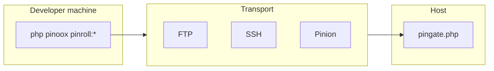
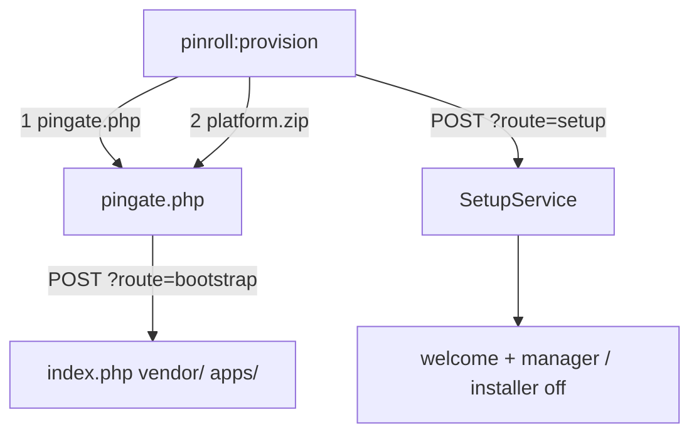

# Pinroll — Release & Deploy

[← Back to index](../README.md)

> **New here?** [Pinroll quick start](../start/pinroll-quickstart.md) — install, connect, and deploy in plain language.

Pinroll (`pinoox/pinroll`) ships a Pinoox project to a remote host: first install, updates, migrate/patch, and rollback.

Install it on the **dev machine**. The host does **not** need Pinroll in `vendor/`.

```bash
composer require --dev pinoox/pinroll
php pinoox pinroll:init
# fill FTP/SSH in .pinoox/pinroll.config.php or PINROLL_* in .env
```

Then pick a scenario. Full reference is in [Advanced](#advanced).

---

## Scenarios

### 1. Blank host (first install)

Empty FTP/SFTP folder — no `index.php` yet.

```bash
php pinoox pinroll:init
# PINROLL_HOST / USER / PASSWORD / URL
# PINROLL_DB_USERNAME / PINROLL_DB_PASSWORD (and database name if not pinoox)
php pinoox pinroll:provision
```

What it does: upload `pingate.php` → extract `platform.zip` → run installer setup (DB + admin).

Admin defaults if you omit them:

| Field | Default |
|-------|---------|
| First name | `support` |
| Last name | `pinoox` |
| Email | `info@pinoox.com` |
| Username | `admin` |
| Password | `123456` |

Change these in production (`PINROLL_ADMIN_*` or `--admin-*`).

After a successful setup (same as the web installer):

- `/` → `com_pinoox_welcome`
- `/manager` → `com_pinoox_manager`
- `com_pinoox_installer` is **disabled**

Later updates are `pinroll:deploy`, not provision again.

If extract worked but setup failed:

```bash
php pinoox pinroll:provision --setup-only
```

`--force` can extract over an existing `index.php` and re-run setup. `--reupload` rebuilds `platform.zip`.

Pinx shortcut: `pinx provision`.

### 2. Existing site

The site is already running. Connect once, then deploy.

```bash
php pinoox pinroll:connect
php pinoox pinroll:apps
php pinoox pinroll:check
php pinoox pinroll:deploy
```

`pinroll:connect` asks for deploy path + site origin (e.g. `https://pinoox.com`), uploads PinGate, and writes **site + token** into `.pinoox/pinroll.config.php`. If the host is already configured, it only checks connectivity (`--reset` to redo).

**`pinroll:deploy` steps (with remote install):**

1. Build — create `.pinx`
2. Connect FTP
3. **Ensure PinGate** — verify `pingate.php`; auto-upload if broken or outdated
4. **Cleanup leftovers** — prune old/stale archives, tmp, and leftover deploy zips
5. Upload `.pinx`
6. Install via PinGate

Upload only: `pinroll:push`. Install staged file only: `pinroll:install`.

### 3. Update platform + every app

```bash
php pinoox pinroll:deploy --full
```

Builds a platform zip (`pinx:update` on the host) and every discovered/installed app. Host `apps[]` is ignored unless you pass `--app` / `--apps`.

### 4. Update one app

```bash
php pinoox pinroll:deploy --app=com_pinoox_shop
php pinoox pinroll:push --app=com_pinoox_shop     # upload only
php pinoox pinroll:install --app=com_pinoox_shop  # install staged
```

### 5. After files are on disk — migrate, patch, seed

On the host (SSH into the site root) or on this machine:

```bash
php pinoox pinroll:setup                 # migrate + patch (platform, then apps)
php pinoox pinroll:setup --dry-run
php pinoox pinroll:setup --migrate --patch --seed
php pinoox pinroll:setup --app=com_pinoox_shop --migrate
```

This is **not** PinGate `POST ?route=setup` (that is first-install SetupService). `pinx setup` is also different (local single-app deps).

### 6. Rollback

```bash
php pinoox pinroll:rollback
php pinoox pinroll:rollback --deploy-id=20260710_091021_3f980930
```

Restores the previous **package files**. It does not automatically reverse database migrations.

### 7. Single-app (Pinx)

```bash
composer require --dev pinoox/pinroll
pinx provision          # blank host
pinx deploy --full      # later updates
```

---

## Advanced

How Pinroll works, config, PinGate, retention, and every flag.

### What it is

Pinroll is a **Composer library**, not a Pinoox app. Commands register when the package is installed.

| Concept | Meaning |
|---------|---------|
| **Host** | Where to deploy (`production`, `staging`, …) — the config key is the name |
| **Transport (`via`)** | How to send files (`ftp`, `ssh`, `pinion`, `local`) |
| **PinGate** | One public file on the host (`pingate.php?route=`) for install / status / rollback / vendor / first-time provision |
| **Bundle** | Optional build recipe (`--bundle=…`); normal deploys auto-detect apps |



| Layer | Location |
|-------|----------|
| Engine | `pinoox/pinroll` |
| Canonical config | `vendor/pinoox/pinroll/config/pinroll.php` (complete schema) |
| Project overlay | `.pinoox/pinroll.config.php` (gitignored with `.pinoox/`) — any override, including secrets |
| PinGate | `{deploy_path}/pingate.php` |
| Runtime | `storage/pinroll/` |
| Local build | `apps/{package}/pinx/export/` |

The host does **not** need Pinroll in `vendor/`. `pingate.php` installs with pincore (`pinx:install` / `pinx:update`) and Pinion. Put Pinroll in `require` only if you want PinGate to use Pinroll classes on the server.

### Configuration

There is **one complete config**: `vendor/pinoox/pinroll/config/pinroll.php` inside the Pinroll library (defaults for globals, provision, build, and `hosts.production`).

The project file is an **optional overlay**, not a generated clone:

| File | Git | Role |
|------|-----|------|
| Library `config/pinroll.php` | in the package | Canonical schema |
| `.pinoox/pinroll.config.php` | ignored (whole `.pinoox/`) | Any override, including `gate.site`, `gate.token`, FTP password |
| `.env` `PINROLL_*` | ignored | Optional CI overlay (last wins) |

```bash
php pinoox pinroll:init
php pinoox pinroll:config    # resolved host (token redacted)
```

`pinroll:init` writes a **short overlay stub** (commented examples). Library defaults are enough to run; `pinroll:connect` then patches the overlay.

```php
<?php

/**
 * Pinroll overlay — gitignored with .pinoox/
 * Canonical schema: vendor/pinoox/pinroll/config/pinroll.php
 */
return [
    'hosts' => [
        'production' => [
            'gate' => [
                'site' => 'https://pinoox.com',  // origin only
                'token' => 'shared-host-token',
            ],
            'ftp' => [
                'password' => '',
            ],
        ],
    ],
];
```

Store **site origin** (`https://pinoox.com` or `https://pinoox.com/shop`), not `…/pingate.php?route=`. Pinroll appends `/pingate.php?route=` at runtime. Legacy full URLs still work.

#### Shared host token

PinGate stores **one hash** in `pingate.php`. The last `connect` / `gate --rotate` that uploads the file wins; everyone else gets 401.

- **One token per host**, shared like an FTP password (1Password / teammate copy / CI secret).
- First developer: `pinroll:connect` → uploads `pingate.php` + writes token to **their** overlay.
- Others: copy the **same token** into their overlay (or `.env`). Do **not** `--rotate` unless you intend to invalidate everyone.

`pinroll:connect` / `pinroll:gate` write site, token, and FTP password into the overlay — not `.env`. `.env` `PINROLL_*` still works for CI.

| Key | Description |
|-----|-------------|
| `default_host` | Host used when CLI omits the name |
| `deploy_path` | Deploy root relative to FTP/SSH login |
| `hostname` | Connection address when it differs from transport host |
| `via` | `ftp`, `ssh`, `pinion`, or `local` |
| `gate.site` / `gate.token` | Site origin + shared PinGate token |
| `ftp` / `ssh` | Connection credentials |
| `apps` | Default packages for push/install |
| `hooks` | Shell commands around push / install / rollback |
| `keep` / `store` / `auto_clean` | Retention |
| `clean_before_deploy` | Prune leftovers before each upload/deploy (default `true`) |
| `stale_days` | Also delete archives/zips older than N days (default `7`; `0` = count-only) |
| `provision` | First-time DB + admin (blank host) |
| `build` | Extra platform zip exclude/include |

Production also reads **unscoped** `.env` keys (`PINROLL_VIA`, `PINROLL_DB_HOST`, `PINROLL_SITE`, …). Other hosts use `PINROLL_{HOST}_*` (example: `PINROLL_STAGING_SITE`).

```env
PINROLL_VIA=ftp
PINROLL_PATH=public_html
PINROLL_WEB_PATH=
PINROLL_KEEP=3
PINROLL_STORE=remote
PINROLL_AUTO_CLEAN=true
PINROLL_SITE=https://example.com
PINROLL_TOKEN=…
PINROLL_HOST=ftp.example.com
PINROLL_USER=…
PINROLL_PASSWORD=…

PINROLL_LANG=en
PINROLL_DB_HOST=localhost
PINROLL_DB_DATABASE=pinoox
PINROLL_DB_USERNAME=…
PINROLL_DB_PASSWORD=…
PINROLL_DB_CONNECTION=mysql
PINROLL_DB_PORT=3306
PINROLL_DB_PREFIX=pin_
PINROLL_DB_TIMEZONE=+03:30
PINROLL_ADMIN_FNAME=support
PINROLL_ADMIN_LNAME=pinoox
PINROLL_ADMIN_EMAIL=info@pinoox.com
PINROLL_ADMIN_USERNAME=admin
PINROLL_ADMIN_PASSWORD=123456

PINROLL_BUILD_EXCLUDE=docs,tests
PINROLL_BUILD_INCLUDE=
```

Load order: **library canonical → project overlay (deep merge) → `PINROLL_*`**. Nested host keys merge too: overlaying only `hosts.production.gate.site` does not wipe library `via` / `ftp` defaults.

Provision merge order: **CLI flags → `.env` → host `provision` → global `provision` → defaults**. Empty values do not override defaults.

#### `deploy_path` vs site URL

`deploy_path` is the FTP folder at account root. The site URL is used **as entered** for PinGate — path and URL are not mixed.

| FTP folder | Site URL | Gate URL |
|------------|----------|----------|
| `apps` | `https://apps.example.com` | `https://apps.example.com/pingate.php?route=` |
| `public_html` | `https://example.com` | `https://example.com/pingate.php?route=` |
| `public_html/shop` | `https://example.com/shop` | `https://example.com/shop/pingate.php?route=` |

Routing is `?route=` only. Do **not** use PATH_INFO (`pingate.php/push/…`).

### Blank-host provision (details)

Use once on an **empty** folder. Host PHP needs `ZipArchive` and enough time/memory (up to 10 minutes). The database must be reachable **from the host**.



Ways to pass credentials:

```bash
# .env only
php pinoox pinroll:provision --no-interaction

# interactive wizard (DB asked; admin defaults if empty)
php pinoox pinroll:provision

# CLI flags
php pinoox pinroll:provision production \
  --db-host=localhost --db-database=pinoox --db-username=root --db-password=secret \
  --admin-username=admin --admin-password=secret1 --lang=en
```

Post-install routes come from `apps/com_pinoox_installer/config/app.config.php`.

### `--full` vs `--all`

| Flag | Meaning |
|------|---------|
| (default) | App `.pinx` only |
| `--full` | Platform zip + **every** installed/discovered app |
| `--all` | App + vendor + theme (+ platform when the host rule includes it) |
| `--vendor` | FTP sync of raw `vendor/` (no apps in the same run) — prefer `pinroll:vendor --push` |
| `--theme` | Rebuild theme assets (`fe:build`) then include dist |

```bash
php pinoox pinroll:deploy --full
php pinoox pinroll:push --full
pinx deploy --full
```

`pinx:build platform` reads `platform/build.config.php`, then **merges** `.pinoox/pinroll.config.php` → `build` (lists are concatenated). Optional env: `PINROLL_BUILD_EXCLUDE` / `PINROLL_BUILD_INCLUDE` (comma-separated).

### `pinroll:setup` (details)

Default (no step flags): **migrate + patch** for `platform` then discovered / host apps. If you pass any step flag, **only those** run. Order: `config` → `migrate` → `seed` → `patch`.

| Flag | Effect |
|------|--------|
| (default) | migrate + patch |
| `--migrate` | Database migrations |
| `--patch` | Data patches |
| `--seed` | Seeders (opt-in; not in the default set) |
| `--config` | Rewrite legacy `pinroll.config.php` (`targets` → `hosts`) |
| `--dry-run` | Preview without applying (`seed` is skipped) |
| `--skip-platform` | Apps only |
| `--force` | Continue after a failed step / overwrite config |
| `--app=` / `--apps=` | Package selection |
| `--class=` | Specific seeder or patch class |

Deprecated: `pinroll:migrate-config` → `--config`; `pinroll:migrate:dry-run` → `--migrate --dry-run`.

### Apps selection

If `hosts.*.apps` is empty and you omit `--app` / `--apps`, push/deploy prompts interactively.

```bash
php pinoox pinroll:apps                         # picker
php pinoox pinroll:apps --apps=com_pinoox_shop
php pinoox pinroll:apps --all
php pinoox pinroll:apps --list
php pinoox pinroll:apps --clear
```

### Connect

```bash
php pinoox pinroll:connect
php pinoox pinroll:connect --reset
php pinoox pinroll:config
```

Writes `gate.site` (origin) + token into the overlay. `--rotate` on `pinroll:gate` mints a new hash and **invalidates teammates**.

### Local modes

**`via: local`** — archives go to `storage/pinroll/incoming/` on this machine (no FTP/SSH):

```bash
php pinoox pinroll:push --via=local --app=com_pinoox_shop
```

**`pinroll:install --local`** — after SSH into production (site root):

```bash
php pinoox pinroll:install --local
php pinoox pinroll:install --local --list
```

### Retention

| Key | Values | Behavior |
|-----|--------|----------|
| `keep` | `0`…`N` | Newest N kept; `0` disables trimming |
| `store` | `local` \| `remote` \| `both` | Which side(s) keep archives |
| `auto_clean` | bool | After successful install, prune beyond `keep` |
| `clean_before_deploy` | bool | Before upload/deploy, prune leftovers (default `true`) |
| `stale_days` | int | Also delete archives/zips older than N days (default `7`; `0` = keep-count only) |

| `store` | Archives kept on | After install |
|---------|------------------|---------------|
| `remote` (default) | Host `storage/pinroll/incoming/` | Trimmed to `keep` |
| `local` | Dev incoming + pinx export | Local trim only |
| `both` | Dev machine **and** host | Both trimmed |

On multi-app `pinroll:deploy`, cleanup runs only after the **last** install.

Local prune: `storage/pinroll/incoming/*.pinx`, `apps/{package}/pinx/export/*.pinx`, temp dirs under `storage/`.  
Remote prune: host `storage/pinroll/incoming/` via PinGate `/cleanup`.

```bash
php pinoox pinroll:cleanup
php pinoox pinroll:cleanup --local
php pinoox pinroll:cleanup --dry-run
php pinoox pinroll:cleanup -k=2
```

### Hooks

```php
'hooks' => [
    'before_push' => ['npm run build'],
    'after_push' => [],
    'before_install' => ['php pinoox migrate --force'],
    'after_install' => ['php pinoox cache:build'],
    'before_rollback' => [],
    'after_rollback' => [],
],
```

| Hook | Runs on | When |
|------|---------|------|
| `before_push` / `after_push` | Developer machine | Around archive upload |
| `before_install` / `after_install` | Host (or `--local`) | Around Pinx install |
| `before_rollback` / `after_rollback` | Host / local pipeline | Around rollback |

### Rollback and migrations

`pinroll:rollback` re-installs a **previous package** (code) with force. It does **not** reverse every DB migration or data patch.

| Layer | On rollback |
|-------|-------------|
| App files / Pinx package | Restored from previous archive |
| Migrations with `down()` | Only if you run migrate rollback (e.g. a hook) |
| One-way patches / data fixes | Not undone |

Prefer forward-fix releases. Write reversible migrations when rollback matters. Keep `keep >= 2` (and `store: both`). Take a DB backup before risky deploys.

```bash
php pinoox pinroll:setup --dry-run
```

### Host vendor

PinGate needs a complete platform `vendor/` on the host (pincore + Pinion). Pinroll itself can stay `require-dev` on the developer machine.

`pinroll:vendor` builds a **production** `pinroll/vendor.zip` with the same PlatformComposer pipeline as `pinx:build platform`: strips `require-dev`, keeps production packages, materializes Composer path repos.

```bash
php pinoox pinroll:vendor
php pinoox pinroll:vendor --push
```

| Flag | Effect |
|------|--------|
| (default) | Write `pinroll/vendor.zip` |
| `--push` | FTP upload + PinGate extract |
| `--prune` | Also prune tests/docs inside vendor |
| `-o` / `--output=` | Custom zip path |

```bash
php pinoox pinroll:gate -n
php pinoox pinroll:vendor --push -n
php pinoox pinroll:check
```

PinGate `POST /vendor` only accepts `vendor.zip` next to `pingate.php`, extracts only `vendor/` entries (zip-slip safe), and deletes the zip after success.

Prefer `pinroll:vendor --push` over `pinroll:deploy --vendor`.

### App frontend (theme dist)

App deploys run `fe:build` before `pinx:build`. Production `.pinx` packages include theme `dist/` and exclude theme `src/` / Vite tooling (even when `dist/` is gitignored).

### PinGate routes

Auth: `Authorization: Bearer {token}`. Paths are `pingate.php?route=…`.

**Security:** Without a token, every route returns `401 JSON`. `/status` is lightweight (no heavy platform boot).

| Method | Path | Purpose |
|--------|------|---------|
| `GET` | `/status` | Health / version |
| `GET` | `/incoming` | List staged releases |
| `POST` | `/install` | Install staged release (`/apply` BC) |
| `POST` | `/bootstrap` | Extract uploaded `platform.zip` (first install) |
| `POST` | `/setup` | Installer SetupService (`db` + `user`) then welcome/manager + disable installer |
| `POST` | `/check-db` | Test DB connection **on the host** |
| `POST` | `/vendor` | Extract uploaded `vendor.zip` |
| `POST` | `/rollback` | Re-install previous release |
| `POST` | `/cleanup` | Prune old archives |
| `GET` | `/history` | Rollout history |

### CLI reference

| Command | Purpose |
|---------|---------|
| `pinroll:init` | Short overlay stub in `.pinoox/pinroll.config.php` |
| `pinroll:provision` | Blank-host install (PinGate + platform.zip + setup) |
| `pinroll:connect` | Setup / verify host (`--reset` to redo); writes site + token to overlay |
| `pinroll:config` | Print resolved host (token redacted) |
| `pinroll:apps` | Set `hosts.*.apps` |
| `pinroll:vendor` | Production `vendor.zip` (`--push` to host) |
| `pinroll:gate` | Build / upload PinGate |
| `pinroll:check` | Verify host / PinGate |
| `pinroll:push` | Build & upload only |
| `pinroll:setup` | Post-deploy migrate + patch (`--seed`, `--config`, `--dry-run`) |
| `pinroll:install` | Install staged release (`pinroll:apply` is a deprecated alias) |
| `pinroll:deploy` | Push + install |
| `pinroll:rollback` | Rollback via PinGate or local re-push |
| `pinroll:cleanup` | Prune archives (`--local`, `--dry-run`, `-k`) |
| `pinroll:build` | Build only |
| `pinroll:status` | Rollout status |
| `pinroll:history` | Deploy history |
| `pinroll:pull` | Pull newer manifest from a release server |

```bash
php pinoox pinroll:push
php pinoox pinroll:install
php pinoox pinroll:deploy
php pinoox pinroll:deploy --app=com_pinoox_shop
php pinoox pinroll:install staging --app=com_pinoox_shop
```

Push / deploy flags: `--full`, `--all`, `--vendor`, `--theme`, `--app=` / `--apps=`, `--via=`, `--host=`.

### Transports

| `via` | Use case |
|-------|----------|
| `ftp` | Shared hosting — upload + PinGate install |
| `ssh` | VPS — SFTP upload, SSH install |
| `pinion` | Chunked HTTP upload through PinGate |
| `local` | Same machine / smoke tests |

### Troubleshooting

| Symptom | Likely cause / fix |
|---------|---------------------|
| `401` / Missing bearer token | Overlay token does not match hash in `pingate.php` — ask a teammate or run `pinroll:connect` / `pinroll:gate` |
| `503` or HTML instead of JSON | Host overload or broken/outdated `pingate.php` — `pinroll:gate` or a new deploy (Ensure PinGate step) |
| PinGate request failed (HTTPS) | On Windows/MAMP: Pinroll 1.5.2+ uses a real CA bundle; run `pinroll:check` again |
| Cannot redeclare `pinroll_pingate_run` | Corrupt `pingate.php` on the host — `php pinoox pinroll:gate` |
| Package install failed | PinGate log: `storage/pinroll/gate/YYYYMMDD.log` on the dev machine |
| cleanup warning after install | Usually non-blocking; lighter `/cleanup` may come in a later release |

```bash
php pinoox pinroll:check
php pinoox pinroll:gate -n
php pinoox pinroll:config
```

---

## Related docs

- [Pinroll quick start](../start/pinroll-quickstart.md)
- [Pinroll overview](../advanced/pinroll.md)
- [Pinion protocol](../advanced/pinion.md)
- [Pinx CLI](../start/pinx-cli.md)
- [CLI reference](../start/cli-reference.md)

---

[← Back to index](../README.md)
