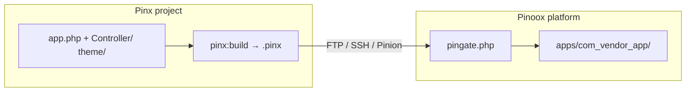

# Deploy a Pinx app (package only)

[← Back to index](../README.md)

This is the **Pinx single-app** deploy path: build **only** this project’s `.pinx` package, upload it, and **install or update that package** on a Pinoox platform host.

It does **not** upload the whole project (`platform/`, `vendor/`, `.env`, source tree).

Full Pinroll reference (hosts, PinGate, provision, flags): [Pinroll — release & deploy](./pinroll.md)

---

## What gets shipped

| Layer | Sent? |
|-------|--------|
| This app’s `.pinx` (code + theme `dist/`) | **Yes** — always |
| Host platform (`index.php`, `vendor/pinoox/pincore`, Manager) | No — already on the host |
| Local `platform/`, `bin/`, `.env`, `vendor/` | No — excluded from `pinx build` |
| Platform zip (`--full` / `--platform`) | Only if you opt in |

On the host the package lands under `apps/{package}/` (install or update). Same APIs as Manager → Applications (`pinx:install`).



---

## Prerequisites

1. A **Pinx** project (`app.php` at the root — not a multi-app `apps/` tree).
2. A **running Pinoox platform** on the host (Welcome + Manager). Blank FTP folder? Run `pinx provision` **once**, then come back here.
3. `pinoox/pinroll` on **your machine** (the host does not need it in `vendor/`).

```bash
cd my-shop
composer require --dev pinoox/pinroll
pinx pinroll:init
```

---

## One-time host connect

Pick one:

| Method | When | Command |
|--------|------|---------|
| **FTP** | Shared hosting | `pinx connect --via=ftp` |
| **SSH** | VPS | `pinx connect --via=ssh` |
| **Zip kit** | File Manager only | `pinx kit` → extract into `public_html` |

```bash
pinx connect --via=ftp
pinx pinroll:check
```

Config (gitignored): `.pinoox/pinroll.config.php`. Optional `PINROLL_*` in `.env` — **Env wins**. Pinroll does not auto-insert or rewrite `.env`.

### Connect with Env only

`PINROLL_TOKEN` may be the plaintext from `pinroll:token`, **or** the `hash` field in `storage/pinroll/tokens/{label}.php` on the host:

```dotenv
PINROLL_TOKEN=b16f0a9d…   # hash from yoose.php is accepted
PINROLL_LABEL=yoose
PINROLL_SITE=https://pinoox.com
PINROLL_VIA=pinion
PINROLL_PATH=public_html
```

If the host PinGate is older and rejects the hash, extract `pinx kit` over `pingate.php` once, then `pinx pinroll:check`.

```bash
pinx pinroll:check
pinx deploy
```

---

## Deploy / update this package

```bash
pinx deploy
```

That is the whole loop. Pinx:

1. Targets **this** `app.php` package (`--app=` is set for you).
2. Runs `fe:build` when a frontend stack exists.
3. Runs `pinx:build` → one `.pinx` file.
4. Uploads that file (not the project).
5. Installs or updates `apps/{package}/` via PinGate.

Later releases are the same command. Bump version first if you want:

```bash
pinx release --bump=patch
pinx deploy
```

Optional:

```bash
pinx deploy --check          # pinroll:check first
pinx deploy --via=ftp
pinx deploy production
```

After files are live (migrations / patches):

```bash
php pinoox pinroll:setup --app=com_acme_shop --skip-platform
```

---

## What not to use (for this path)

| Command | Why |
|---------|-----|
| `pinx deploy --full` | Also builds and ships a **platform zip** + every app. Use when you intend to update the host kernel, not for day-to-day app releases. |
| `pinx provision` | First-time **empty** host (platform.zip + installer). Not an app update. |
| `pinx build` only | Creates `.pinx` locally. You still need Pinroll (or Manager upload) to install it. |

---

## Host must already have a platform

The `.pinx` installer needs pincore on the server. Typical first-time sequence:

```bash
pinx provision          # once: platform + DB + admin
pinx deploy             # this app's .pinx → apps/{package}/
```

Then route the domain (or a path) to this app in Manager.

---

## Related

- [Pinroll — quick start](../start/pinroll-quickstart.md)
- [Pinroll — full reference](./pinroll.md)
- [Pinx CLI](../start/pinx-cli.md)
- [Build and release `.pinx`](../start/build-release.md)

---

[← Back to index](../README.md)
