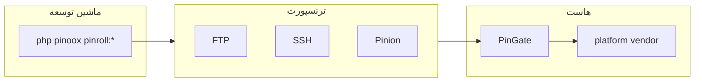

# Pinroll — موتور انتشار

[← بازگشت به فهرست](../README.md)

> **راهنمای کامل:** [دیپلوی → Pinroll](../deploy/pinroll.md) (هاست، connect، apps، retention، rollback).

**Pinroll** (`pinoox/pinroll`) release می‌سازد، به **هاست** می‌فرستد و از طریق **PinGate** نصب می‌کند. یک کتابخانه Composer است؛ دستورات با نصب ثبت می‌شوند.

به‌عنوان وابستگی **production** نصب کنید (`composer require pinoox/pinroll`)، نه فقط `require-dev` — PinGate روی هاست به آن نیاز دارد.

| مفهوم | معنی |
|-------|------|
| **Host** | مقصد دیپلوی (`production`، …) — کلید کانفیگ همان نام است |
| **`via`** | ترنسپورت: `ftp`، `ssh`، `pinion`، `local` |
| **PinGate** | API روی هاست: `pingate.php` + `gate/` |
| **Bundle** | دستور ساخت اختیاری (`--bundle=…`) |

---

## چرا Pinroll؟

| مشکل | راه‌حل |
|------|--------|
| دیپلوی دستی FTP | push اسکریپتی + نصب PinGate |
| سایت نیمه‌دیپلوی‌شده | نصب اتمیک + rollback |
| هاست اشتراکی بدون SSH | آپلود FTP + نصب از راه HTTP |
| به‌روزرسانی هسته / vendor روی هاست | `pinroll:vendor --push` → zip production + استخراج PinGate |

---

## معماری



| لایه | مسیر |
|------|------|
| موتور | `pinoox/pinroll` |
| کانفیگ پروژه | `pinroll/pinroll.config.php` |
| ورودی PinGate | `{deploy_path}/pingate.php` |
| اپ PinGate | `{deploy_path}/gate/` |
| Runtime | `storage/pinroll/` |
| خروجی بیلد لوکال | `apps/{package}/pinx/export/` |

---

## دستورات ضروری

```bash
php pinoox pinroll:init
php pinoox pinroll:connect              # بار اول setup؛ بعداً فقط verify
php pinoox pinroll:apps --apps=com_pinoox_shop
php pinoox pinroll:vendor --push        # vendor.zip production → هاست (PlatformComposer)
php pinoox pinroll:check
php pinoox pinroll:push                 # فقط ساخت و آپلود
php pinoox pinroll:install              # نصب release آماده‌شده روی هاست
php pinoox pinroll:deploy               # push + install (default_host + apps[])
php pinoox pinroll:rollback
php pinoox pinroll:cleanup --local
php pinoox pinroll:cleanup --dry-run
```

---

## تنظیمات Pinroll

```php
'default_host' => 'production',
'keep' => 2,
'store' => 'both',
'auto_clean' => true,

'hosts' => [
    'production' => [
        'deploy_path' => 'public_html',
        'via' => 'ftp',
        'apps' => ['com_pinoox_shop'],
        'gate' => [ /* url, token */ ],
        'ftp' => [ /* host, user, password */ ],
    ],
],
```

---

## مستندات مرتبط

- [راهنمای دیپلوی Pinroll](../deploy/pinroll.md)
- [Pinion](./pinion.md)
- [نسخه انگلیسی](../../en/advanced/pinroll.md)

---

[← بازگشت به فهرست](../README.md)
