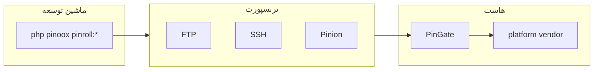

# Pinroll — موتور انتشار

[← بازگشت به فهرست](../README.md)

> **نحوه استفاده:** [دیپلوی → Pinroll](../deploy/pinroll.md) — اول سناریوها، بعد بخش پیشرفته.

**Pinroll** (`pinoox/pinroll`) release می‌سازد، به **هاست** می‌فرستد و از طریق **PinGate** نصب می‌کند. یک کتابخانه Composer است؛ دستورات با نصب ثبت می‌شوند.

به‌صورت **dev** نصب کنید (`composer require --dev pinoox/pinroll`). هاست به Pinroll داخل `vendor/` نیاز ندارد — `pingate.php` از pincore استفاده می‌کند.

| مفهوم | معنی |
|-------|------|
| **Host** | مقصد دیپلوی (`production`، …) — کلید کانفیگ همان نام است |
| **`via`** | ترنسپورت: `ftp`، `ssh`، `pinion`، `local` |
| **PinGate** | API روی هاست: یک فایل `pingate.php` (`?route=`) |
| **Bundle** | دستور ساخت اختیاری (`--bundle=…`) |

---

## چرا Pinroll؟

| مشکل | راه‌حل |
|------|--------|
| دیپلوی دستی FTP | push اسکریپتی + نصب PinGate |
| سایت نیمه‌دیپلوی‌شده | نصب اتمیک + rollback |
| هاست اشتراکی بدون SSH | آپلود FTP + نصب از راه HTTP |
| هاست خالی، هنوز سایت نیست | `pinroll:provision` (PinGate + platform.zip + setup نصب‌کننده) |
| اسکیما بعد از دیپلوی | `pinroll:setup` (migrate + patch؛ اختیاری `--seed`) |
| به‌روزرسانی هسته / vendor روی هاست | `pinroll:vendor --push` |

---

## معماری



| لایه | مسیر |
|------|------|
| موتور | `pinoox/pinroll` |
| کانفیگ canonical | `config/pinroll.php` کتابخانه |
| Overlay پروژه | `.pinoox/pinroll.config.php` (gitignore) |
| ورودی PinGate | `{deploy_path}/pingate.php` |
| Runtime | `storage/pinroll/` |
| خروجی بیلد لوکال | `apps/{package}/pinx/export/` |

---

## دستورات رایج

```bash
php pinoox pinroll:init
php pinoox pinroll:provision           # هاست خالی
php pinoox pinroll:connect             # سایت موجود
php pinoox pinroll:config              # هاست resolveشده (token سانسور)
php pinoox pinroll:deploy --full       # پلتفرم + همه اپ‌ها
php pinoox pinroll:setup               # migrate + patch
php pinoox pinroll:rollback
```

---

## مستندات مرتبط

- [راهنمای دیپلوی Pinroll](../deploy/pinroll.md) — سناریوها + مرجع کامل
- [Pinion](./pinion.md)
- [مرجع CLI](../start/cli-reference.md)

---

[← بازگشت به فهرست](../README.md)
