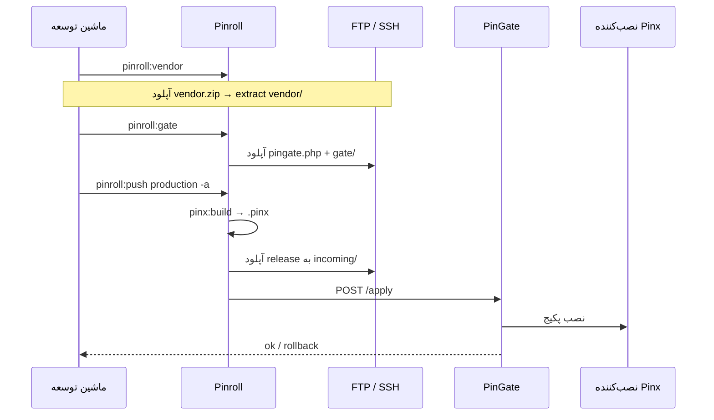

# Pinroll — انتشار و دیپلوی

[← بازگشت به فهرست](../README.md)

**Pinroll** (`pinoox/pinroll`) موتور رسمی انتشار و rollout پینوکس است. پکیج اپ می‌سازد، به سرور می‌فرستد، از طریق **PinGate** به‌صورت اتمی اعمال می‌کند و rollback و cleanup دارد.

Pinroll یک **کتابخانه Composer** است — نه اپ پینوکس. با نصب پکیج، دستورات CLI ثبت می‌شوند.

| مفهوم | معنی |
|-------|------|
| **Target** | مقصد دیپلوی (`production` و …) |
| **Transport (`via`)** | نحوه ارسال (`ftp`، `ssh`، `pinion`، `local`) |
| **PinGate** | نقطه ورود HTTP روی هاست (`pingate.php` + `gate/`) برای apply / status / rollback |
| **Bundle** | دستورالعمل اختیاری build (`single-app`، `platform-full` و …) |

> **جریان معمول هاست اشتراکی:** تنظیم FTP + gate → `pinroll:vendor` (هسته/وابستگی‌ها) → `pinroll:gate` → `pinroll:push -a`.

---

## نصب

روی پروژه **platform** پینوکس:

```bash
composer require pinoox/pinion pinoox/pinroll
```

توسعه محلی با checkout هم‌سطح:

```json
"repositories": [
  { "type": "path", "url": "../pinroll", "options": { "symlink": true } }
],
"require": {
  "pinoox/pinroll": "@dev"
}
```

---

## راه‌اندازی پروژه

```bash
php pinoox pinroll:init
php pinoox pinroll:init -w   # ویزارد تعاملی (FTP، dir، PinGate)
```

خروجی در ریشه پروژه:

```
pinroll/
  pinroll.config.php
  bundles/
    single-app.php
    platform-core.php
    platform-full.php
    test-empty.php
```

secretها را در `.env` نگه دارید. در صورت نیاز `pinroll/` را در `.gitignore` بگذارید.

---

## پیکربندی

### Targetها (`pinroll/pinroll.config.php`)

فرمت فعلی: **`via`**, بلوک سطح‌بالای **`gate`**, و credentialها زیر `ftp` / `ssh` / `pinion`:

```php
<?php

return [
    'targets' => [
        'production' => [
            // مسیر نسبت به لاگین FTP/SSH (سایت روی ریشه دامنه → public_html)
            'dir' => 'public_html',
            'via' => 'ftp',

            'gate' => [
                'url' => env('PINROLL_PRODUCTION_URL', ''),
                'token' => env('PINROLL_PRODUCTION_TOKEN', ''),
            ],

            'ftp' => [
                'host' => env('PINROLL_PRODUCTION_HOST', ''),
                'user' => env('PINROLL_PRODUCTION_USER', ''),
                'password' => env('PINROLL_PRODUCTION_PASSWORD', ''),
            ],

            'apps' => [
                'com_pinoox_shop',
            ],
        ],
    ],
];
```

| کلید | توضیح |
|------|--------|
| `dir` | ریشه دیپلوی نسبت به لاگین FTP/SSH. سایت روی ریشه دامنه: `public_html`. زیرپوشه: مثلاً `public_html/shop`. خالی = ریشه لاگین. |
| `via` | transport پیش‌فرض: `ftp`، `ssh`، `pinion` یا `local` |
| `gate.url` / `gate.token` | اعتبار PinGate (برای apply / pinion مشترک است) |
| `ftp` / `ssh` / `pinion` | فقط اتصال (بدون `gate` تو در تو) |
| `apps` | لیست اختیاری پکیج‌ها برای push |
| `bundle` / `package` | پیش‌فرض اختیاری برای build مبتنی بر recipe |

### کلیدهای `.env`

```env
PINROLL_PRODUCTION_URL=https://pinoox.com/pingate.php?route=
PINROLL_PRODUCTION_TOKEN=…
PINROLL_PRODUCTION_HOST=ftp.pinoox.com
PINROLL_PRODUCTION_USER=…
PINROLL_PRODUCTION_PASSWORD=…
```

`pinroll:gate` خودش URL و token را در `.env` می‌نویسد.

### Bundleها (`pinroll/bundles/*.php`)

دستورالعمل اختیاری برای `pinroll:build`. دیپلوی روزمره معمولاً با `pinroll:push` و `--package=` یا `apps[]` در target است.

---

## شروع سریع (FTP + PinGate)

### ۱. Init و پیکربندی

```bash
php pinoox pinroll:init -w
```

یا `pinroll/pinroll.config.php` و `.env` را دستی ویرایش کنید.

### ۲. خروجی گرفتن از vendor پلتفرم (هسته + وابستگی‌ها)

`pinroll:vendor` کل درخت Composer `vendor/` محلی را برای هاست zip می‌کند. کاربرد:

- **نصب اول** — قرار دادن `vendor/` کامل کنار `pingate.php`
- **به‌روزرسانی هسته پینوکس / وابستگی‌های Packagist** — بعد از `composer update` محلی، دوباره export کنید و `vendor/` هاست را جایگزین کنید
- **ارسال path-repo** — checkoutهای محلی (`../pincore3`، `../pinroll` و …) به‌صورت فایل واقعی داخل zip می‌آیند

```bash
php pinoox pinroll:vendor
# نام‌های جایگزین: pinroll:vendor:pack، pinroll:pack:vendor
```

خروجی: `pinroll/vendor.zip`. روی هاست extract کنید تا `vendor/` کنار `pingate.php` باشد. هنگام آپدیت هسته، `vendor/` قبلی را **جایگزین** کنید.

فایل `.pincore` محلی که به `../pincore3` اشاره می‌کند را آپلود نکنید — روی هاست هسته باید از `vendor/pinoox/pincore` بیاید.

### ۳. نصب PinGate روی هاست

اگر FTP تنظیم باشد، PinGate ساخته می‌شود، **با FTP آپلود** می‌شود و فایل‌های محلی حذف می‌شوند (پیش‌فرض بدون zip):

```bash
php pinoox pinroll:gate
```

| گزینه | معنی |
|--------|------|
| (پیش‌فرض) | ساخت → آپلود FTP برای `pingate.php` + `gate/` → حذف فایل‌های محلی |
| `-z` / `--zip` | ساخت `pinroll/deploy-{target}.zip` برای آپلود دستی |
| `--no-upload` | نگه‌داشتن فایل‌ها در `pinroll/` (بدون FTP) |
| `--rotate` | توکن جدید (پیش‌فرض: استفاده مجدد از `PINROLL_*_TOKEN` در `.env`) |

نام جایگزین: `pinroll:gate:init` هنوز کار می‌کند.

### ۴. بررسی و push

```bash
php pinoox pinroll:check production
php pinoox pinroll:push production -a --package=com_pinoox_shop
```

`-a` بعد از آپلود، **apply از راه دور** را از طریق PinGate اجرا می‌کند.

---

## چیدمان PinGate روی هاست

فایل‌ها **کنار platform** (همان پوشه `vendor/`):

```
{deploy-root}/          # مثلاً public_html/
  pingate.php
  gate/
    index.php
    bootstrap.php
    pingate.php
    vendor/
  vendor/               # از pinroll:vendor
  apps/
  …
```

URL عمومی وقتی سایت روی ریشه دامنه است:

```
https://pinoox.com/pingate.php?route=
```

### `.htaccess` (فقط اگر `pinroll:check` HTML برگرداند)

قبل از قانون front-controller:

```apache
RewriteRule ^pingate\.php$ - [L]
RewriteRule ^gate/ - [L]
```

### Routeهای PinGate

| متد | مسیر | کاربرد |
|-----|------|--------|
| `GET` | `/status` | سلامت / نسخه |
| `GET` | `/incoming` | لیست releaseهای stage‌شده |
| `POST` | `/apply` | اعمال release |
| `POST` | `/rollback` | اعمال مجدد release قبلی |
| `POST` | `/cleanup` | پاکسازی archiveهای قدیمی |
| `POST` | `/push/init` | شروع آپلود chunk (Pinion) |
| `POST` | `/push/upload` | آپلود chunk |
| `POST` | `/push/complete` | پایان آپلود |
| `GET` | `/history` | تاریخچه |

احراز هویت: `Authorization: Bearer {token}`.

---

## مرجع CLI

| دستور | نام جایگزین | کاربرد |
|--------|-------------|--------|
| `pinroll:init` | — | ساخت config؛ `-w` ویزارد |
| `pinroll:vendor` | `pinroll:vendor:pack`، `pinroll:pack:vendor` | خروجی `vendor/` برای نصب هاست یا آپدیت هسته → `pinroll/vendor.zip` |
| `pinroll:gate` | `pinroll:gate:init` | ساخت PinGate؛ آپلود FTP به‌صورت پیش‌فرض (`-z`، `--no-upload`، `--rotate`) |
| `pinroll:gate:token` | — | نمایش توکن / snippet (`--deploy` همان gate را اجرا می‌کند) |
| `pinroll:check` | — | بررسی target / PinGate |
| `pinroll:push` | `pinroll:deploy`، `pinroll:prod` | ساخت و ارسال (`-a` = apply از طریق PinGate) |
| `pinroll:apply` | — | اعمال release روی target (یا `--local` روی خود هاست) |
| `pinroll:rollback` | — | rollback از طریق PinGate |
| `pinroll:cleanup` | `pinroll:prune` | پاکسازی archiveهای قدیمی (`--dry-run`، `-k`) |
| `pinroll:build` | — | فقط build |
| `pinroll:status` | — | وضعیت rollout |
| `pinroll:history` | — | تاریخچه |
| `pinroll:pull` | `pinroll:poll` | دریافت manifest |
| `pinroll:publish` | — | انتشار manifest |
| `pinroll:migrate:dry-run` | — | پیش‌نمایش migration |

### مثال‌های رایج

```bash
php pinoox pinroll:vendor
php pinoox pinroll:gate
php pinoox pinroll:gate -z
php pinoox pinroll:gate --rotate

php pinoox pinroll:check production
php pinoox pinroll:push production -a --package=com_pinoox_shop
php pinoox pinroll:apply production
php pinoox pinroll:rollback production
php pinoox pinroll:cleanup production --dry-run
```

### گزینه‌های push

```bash
php pinoox pinroll:push production -a \
  --package=com_pinoox_shop
```

| گزینه | توضیح |
|--------|--------|
| `-a` / `--apply` | بعد از آپلود، apply از راه دور با PinGate |
| `--package=` | پکیج اپ |
| `--bundle=` | override دستورالعمل bundle |
| `--via=` / `--transport=` | override transport |

---

## Transportها

| `via` | کاربرد |
|-------|--------|
| `ftp` | هاست اشتراکی / cPanel — آپلود فایل؛ apply با PinGate |
| `ssh` | VPS — آپلود/اعمال با SSH |
| `pinion` | آپلود HTTP تکه‌ای از طریق PinGate |
| `local` | همان ماشین / تست |

با **FTP** برای `apply` / `push -a` از راه دور به PinGate نیاز است. `pinroll:gate` bootstrap را با همان FTP آپلود می‌کند.

---

## جریان rollout



---

## ساختار storage

| مسیر | کاربرد |
|------|--------|
| `storage/pinroll/releases/` | archiveهای ساخته‌شده (محلی) |
| `storage/pinroll/incoming/` | releaseهای stage‌شده (هاست / محلی) |
| `storage/pinroll/sessions/` | sessionهای rollout |
| `storage/pinroll/history.jsonl` | لاگ تاریخچه |

---

## مستندات مرتبط

- [پروتکل Pinion](../advanced/pinion.md) — آپلود تکه‌ای
- [Pinx CLI](../start/pinx-cli.md) — `pinx:build`
- [مرجع CLI](../start/cli-reference.md)

---

[← بازگشت به فهرست](../README.md)
