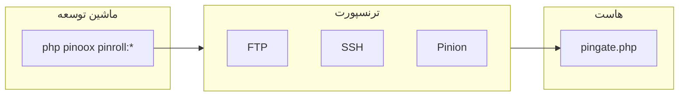
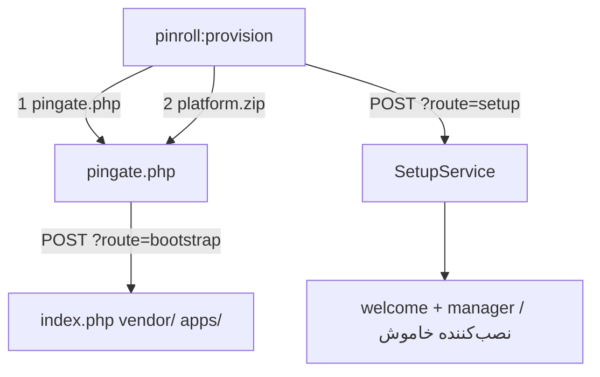

# Pinroll — انتشار و دیپلوی

[← بازگشت به فهرست](../README.md)

Pinroll (`pinoox/pinroll`) پروژه پینوکس را به هاست می‌فرستد: نصب اول، به‌روزرسانی، migrate/patch و rollback.

آن را روی **ماشین توسعه** نصب کنید. هاست به Pinroll داخل `vendor/` نیاز ندارد.

```bash
composer require --dev pinoox/pinroll
php pinoox pinroll:init
# FTP/SSH را در .pinoox/pinroll.config.php یا PINROLL_* در .env پر کنید
```

بعد یکی از سناریوها را انتخاب کنید. مرجع کامل در [پیشرفته](#پیشرفته) است.

---

## سناریوها

### ۱. هاست خالی (نصب اول)

پوشه FTP/SFTP خالی — هنوز `index.php` نیست.

```bash
php pinoox pinroll:init
# PINROLL_HOST / USER / PASSWORD / URL
# PINROLL_DB_USERNAME / PINROLL_DB_PASSWORD (و نام دیتابیس اگر pinoox نیست)
php pinoox pinroll:provision
```

کارش: آپلود `pingate.php` → استخراج `platform.zip` → اجرای setup نصب‌کننده (دیتابیس + ادمین).

اگر ادمین را ندهید، پیش‌فرض این است:

| فیلد | پیش‌فرض |
|------|---------|
| نام | `support` |
| نام خانوادگی | `pinoox` |
| ایمیل | `info@pinoox.com` |
| نام کاربری | `admin` |
| رمز | `123456` |

در پروداکشن عوضش کنید (`PINROLL_ADMIN_*` یا `--admin-*`).

بعد از setup موفق (مثل نصب‌کننده وب):

- `/` → `com_pinoox_welcome`
- `/manager` → `com_pinoox_manager`
- `com_pinoox_installer` **غیرفعال** می‌شود

به‌روزرسانی بعدی `pinroll:deploy` است، نه دوباره provision.

اگر zip استخراج شد ولی setup شکست خورد:

```bash
php pinoox pinroll:provision --setup-only
```

`--force` روی `index.php` موجود extract می‌کند و setup را تکرار می‌کند. `--reupload` دوباره `platform.zip` می‌سازد.

میانبر Pinx: `pinx provision`.

### ۲. سایت موجود

سایت از قبل بالا است. یک‌بار connect، بعد دیپلوی.

```bash
php pinoox pinroll:connect
php pinoox pinroll:apps
php pinoox pinroll:check
php pinoox pinroll:deploy
```

`pinroll:connect` مسیر دیپلوی + origin سایت (مثلاً `https://pinoox.com`) را می‌پرسد، PinGate را آپلود می‌کند و **site + token** را در `.pinoox/pinroll.config.php` می‌نویسد. اگر هاست از قبل تنظیم شده باشد فقط اتصال را بررسی می‌کند (`--reset` برای تکرار).

### ۳. به‌روزرسانی پلتفرم + همه اپ‌ها

```bash
php pinoox pinroll:deploy --full
```

zip پلتفرم (`pinx:update` روی هاست) و همه اپ‌های کشف‌شده/نصب‌شده. `apps[]` هاست نادیده گرفته می‌شود مگر `--app` / `--apps` بدهید.

### ۴. به‌روزرسانی یک اپ

```bash
php pinoox pinroll:deploy --app=com_pinoox_shop
php pinoox pinroll:push --app=com_pinoox_shop     # فقط آپلود
php pinoox pinroll:install --app=com_pinoox_shop  # نصب staged
```

### ۵. بعد از رسیدن فایل‌ها — migrate، patch، seed

روی هاست (SSH به ریشه سایت) یا روی همین ماشین:

```bash
php pinoox pinroll:setup                 # migrate + patch (پلتفرم، بعد اپ‌ها)
php pinoox pinroll:setup --dry-run
php pinoox pinroll:setup --migrate --patch --seed
php pinoox pinroll:setup --app=com_pinoox_shop --migrate
```

این همان `POST ?route=setup` در PinGate نیست (آن نصب اولیه است). `pinx setup` هم فرق دارد (وابستگی لوکال تک‌اپ).

### ۶. Rollback

```bash
php pinoox pinroll:rollback
php pinoox pinroll:rollback --deploy-id=20260710_091021_3f980930
```

فایل‌های **پکیج قبلی** را برمی‌گرداند. migration دیتابیس را خودکار برنمی‌گرداند.

### ۷. پروژه تک‌اپ (Pinx)

```bash
composer require --dev pinoox/pinroll
pinx provision          # هاست خالی
pinx deploy --full      # به‌روزرسانی بعدی
```

---

## پیشرفته

معماری، کانفیگ، PinGate، retention و همه فلگ‌ها.

### چیست؟

Pinroll یک **کتابخانه Composer** است، نه یک اپ پینوکس. دستورات با نصب پکیج ثبت می‌شوند.

| مفهوم | معنی |
|-------|------|
| **Host** | مقصد دیپلوی (`production`، `staging` — کلید آرایه همان نام است) |
| **Transport (`via`)** | نحوه ارسال (`ftp`، `ssh`، `pinion`، `local`) |
| **PinGate** | یک فایل عمومی روی هاست (`pingate.php?route=`) برای install / status / rollback / vendor / نصب اولیه |
| **Bundle** | دستور ساخت اختیاری؛ دیپلوی عادی اپ‌ها را خودکار تشخیص می‌دهد |



| لایه | مسیر |
|------|------|
| موتور | `pinoox/pinroll` |
| کانفیگ canonical | `vendor/pinoox/pinroll/config/pinroll.php` (اسکیمای کامل) |
| Overlay پروژه | `.pinoox/pinroll.config.php` (همراه `.pinoox/` در gitignore) — هر override از جمله اسرار |
| PinGate | `{deploy_path}/pingate.php` |
| Runtime | `storage/pinroll/` |
| بیلد لوکال | `apps/{package}/pinx/export/` |

هاست به Pinroll داخل `vendor/` نیاز ندارد. `pingate.php` با pincore (`pinx:install` / `pinx:update`) نصب می‌کند. Pinroll را فقط وقتی در `require` بگذارید که بخواهید PinGate روی سرور از کلاس‌های Pinroll استفاده کند.

### پیکربندی

**یک کانفیگ کامل** وجود دارد: `vendor/pinoox/pinroll/config/pinroll.php` داخل کتابخانه Pinroll (پیش‌فرض‌های سراسری، provision، build و `hosts.production`).

فایل پروژه یک **overlay اختیاری** است، نه کپی تولیدشده:

| فایل | Git | نقش |
|------|-----|------|
| `config/pinroll.php` کتابخانه | داخل پکیج | اسکیمای canonical |
| `.pinoox/pinroll.config.php` | نادیده (کل `.pinoox/`) | هر override از جمله `gate.site`، `gate.token`، رمز FTP |
| `.env` `PINROLL_*` | نادیده | overlay اختیاری CI (آخرین لایه برنده است) |

```bash
php pinoox pinroll:init
php pinoox pinroll:config    # هاست resolveشده (token سانسور)
```

`pinroll:init` یک **استاب کوتاه** می‌نویسد. پیش‌فرض کتابخانه برای اجرا کافی است؛ `pinroll:connect` بعد overlay را پچ می‌کند.

```php
<?php

/**
 * Overlay پینرول — همراه .pinoox/ در gitignore
 * اسکیمای canonical: vendor/pinoox/pinroll/config/pinroll.php
 */
return [
    'hosts' => [
        'production' => [
            'gate' => [
                'site' => 'https://pinoox.com',  // فقط origin
                'token' => 'shared-host-token',
            ],
            'ftp' => [
                'password' => '',
            ],
        ],
    ],
];
```

**origin سایت** را ذخیره کنید (`https://pinoox.com` یا `https://pinoox.com/shop`)، نه `…/pingate.php?route=`. Pinroll در runtime پسوند را اضافه می‌کند. URL کامل قدیمی هنوز کار می‌کند.

#### توکن مشترک هاست

PinGate فقط **یک hash** در `pingate.php` نگه می‌دارد. آخرین `connect` / `gate --rotate` که فایل را آپلود کند برنده است؛ بقیه 401 می‌گیرند.

- **یک توکن برای هر هاست**، مثل رمز FTP (1Password / کپی هم‌تیمی / secret در CI).
- نفر اول: `pinroll:connect` → آپلود `pingate.php` + نوشتن توکن در overlay خودش.
- بقیه: **همان توکن** را در overlay (یا `.env`) کپی کنند. `--rotate` نزنید مگر بخواهید بقیه را از کار بیندازید.

`pinroll:connect` / `pinroll:gate` مقدار site، token و رمز FTP را در overlay می‌نویسند — نه در `.env`. `.env` `PINROLL_*` برای CI همچنان کار می‌کند.

| کلید | توضیح |
|------|--------|
| `default_host` | هاست وقتی نام در CLI نیست |
| `deploy_path` | ریشه دیپلوی نسبت به لاگین FTP/SSH |
| `hostname` | آدرس اتصال اگر با host ترنسپورت فرق دارد |
| `via` | `ftp`، `ssh`، `pinion` یا `local` |
| `gate.site` / `gate.token` | origin سایت + توکن مشترک PinGate |
| `ftp` / `ssh` | اطلاعات اتصال |
| `apps` | پکیج‌های پیش‌فرض push/install |
| `hooks` | دستورات شل اطراف push / install / rollback |
| `keep` / `store` / `auto_clean` | Retention |
| `provision` | دیتابیس + ادمین نصب اول |
| `build` | exclude/include اضافه برای zip پلتفرم |

برای production کلیدهای **بدون پیشوند هاست** هم خوانده می‌شوند (`PINROLL_VIA`، `PINROLL_DB_HOST`، `PINROLL_SITE`، …). بقیه هاست‌ها: `PINROLL_{HOST}_*`.

```env
PINROLL_VIA=ftp
PINROLL_PATH=public_html
PINROLL_WEB_PATH=
PINROLL_KEEP=3
PINROLL_STORE=remote
PINROLL_AUTO_CLEAN=true
PINROLL_SITE=https://example.com
PINROLL_TOKEN=…
PINROLL_HOST=ftp.example.com
PINROLL_USER=…
PINROLL_PASSWORD=…

PINROLL_LANG=fa
PINROLL_DB_HOST=localhost
PINROLL_DB_DATABASE=pinoox
PINROLL_DB_USERNAME=…
PINROLL_DB_PASSWORD=…
PINROLL_DB_CONNECTION=mysql
PINROLL_DB_PORT=3306
PINROLL_DB_PREFIX=pin_
PINROLL_DB_TIMEZONE=+03:30
PINROLL_ADMIN_FNAME=support
PINROLL_ADMIN_LNAME=pinoox
PINROLL_ADMIN_EMAIL=info@pinoox.com
PINROLL_ADMIN_USERNAME=admin
PINROLL_ADMIN_PASSWORD=123456

PINROLL_BUILD_EXCLUDE=docs,tests
PINROLL_BUILD_INCLUDE=
```

ترتیب بارگذاری: **canonical کتابخانه → overlay پروژه → `PINROLL_*`**. کلیدهای تو در توی هاست هم merge می‌شوند: فقط گذاشتن `hosts.production.gate.site` مقدار `via` / `ftp` کتابخانه را پاک نمی‌کند.

ترتیب ادغام provision: **فلگ CLI → `.env` → `provision` هاست → `provision` سراسری → پیش‌فرض**. مقدار خالی پیش‌فرض را پاک نمی‌کند.

#### `deploy_path` و URL سایت

`deploy_path` پوشه FTP در ریشه اکانت است. URL سایت **همان‌طور که وارد شده** برای PinGate استفاده می‌شود — مسیر و URL قاطی نمی‌شوند.

| پوشه FTP | URL سایت | Gate URL |
|----------|----------|----------|
| `apps` | `https://apps.example.com` | `https://apps.example.com/pingate.php?route=` |
| `public_html` | `https://example.com` | `https://example.com/pingate.php?route=` |
| `public_html/shop` | `https://example.com/shop` | `https://example.com/shop/pingate.php?route=` |

مسیریابی فقط `?route=` است. از PATH_INFO (`pingate.php/push/…`) استفاده نکنید.

### جزئیات provision هاست خالی

یک‌بار روی پوشه **خالی**. PHP هاست باید `ZipArchive` و زمان/حافظه کافی داشته باشد (تا ۱۰ دقیقه). دیتابیس باید از **همان هاست** قابل اتصال باشد.



روش‌های دادن اطلاعات:

```bash
# فقط .env
php pinoox pinroll:provision --no-interaction

# ویزارد (دیتابیس پرسیده می‌شود؛ ادمین اگر خالی باشد پیش‌فرض است)
php pinoox pinroll:provision

# فلگ CLI
php pinoox pinroll:provision production \
  --db-host=localhost --db-database=pinoox --db-username=root --db-password=secret \
  --admin-username=admin --admin-password=secret1 --lang=fa
```

روتر بعد از نصب از `apps/com_pinoox_installer/config/app.config.php` می‌آید.

### `--full` در برابر `--all`

| فلگ | معنی |
|-----|------|
| (پیش‌فرض) | فقط `.pinx` اپ |
| `--full` | zip پلتفرم + **همه** اپ‌های نصب‌شده/کشف‌شده |
| `--all` | اپ + vendor + theme |
| `--vendor` | همگام FTP درخت خام `vendor/` — بهتر است `pinroll:vendor --push` |
| `--theme` | بیلد تم (`fe:build`) و بعد dist |

```bash
php pinoox pinroll:deploy --full
php pinoox pinroll:push --full
pinx deploy --full
```

`pinx:build platform` فایل `platform/build.config.php` را می‌خواند و بعد `build` داخل `.pinoox/pinroll.config.php` را **ادغام** می‌کند (لیست‌ها جمع می‌شوند). env اختیاری: `PINROLL_BUILD_EXCLUDE` / `PINROLL_BUILD_INCLUDE`.

### جزئیات `pinroll:setup`

پیش‌فرض (بدون فلگ مرحله): **migrate + patch** برای `platform` و بعد اپ‌ها. اگر فلگ مرحله بدهید **فقط همان‌ها** اجرا می‌شوند. ترتیب: `config` → `migrate` → `seed` → `patch`.

| فلگ | اثر |
|-----|-----|
| (پیش‌فرض) | migrate + patch |
| `--migrate` | migration دیتابیس |
| `--patch` | پچ داده |
| `--seed` | seeder (در پیش‌فرض نیست) |
| `--config` | بازنویسی `pinroll.config.php` قدیمی (`targets` → `hosts`) |
| `--dry-run` | پیش‌نمایش بدون اجرا (`seed` رد می‌شود) |
| `--skip-platform` | فقط اپ‌ها |
| `--force` | ادامه بعد از خطا / بازنویسی کانفیگ |
| `--app=` / `--apps=` | انتخاب پکیج |
| `--class=` | کلاس مشخص seeder یا patch |

نام‌های قدیمی: `pinroll:migrate-config` → `--config`؛ `pinroll:migrate:dry-run` → `--migrate --dry-run`.

### انتخاب اپ‌ها

اگر `hosts.*.apps` خالی باشد و `--app` / `--apps` ندهید، push/deploy تعاملی می‌پرسد.

```bash
php pinoox pinroll:apps
php pinoox pinroll:apps --apps=com_pinoox_shop
php pinoox pinroll:apps --all
php pinoox pinroll:apps --list
php pinoox pinroll:apps --clear
```

### Connect

```bash
php pinoox pinroll:connect
php pinoox pinroll:connect --reset
php pinoox pinroll:config
```

`gate.site` (origin) و token را در overlay می‌نویسد. `--rotate` روی `pinroll:gate` hash جدید می‌سازد و **هم‌تیمی‌ها را از کار می‌اندازد**.

### حالت‌های local

**`via: local`** — آرشیو در `storage/pinroll/incoming/` همین ماشین:

```bash
php pinoox pinroll:push --via=local --app=com_pinoox_shop
```

**`pinroll:install --local`** — بعد از SSH به پروداکشن (ریشه سایت):

```bash
php pinoox pinroll:install --local
php pinoox pinroll:install --local --list
```

### Retention

| کلید | مقادیر | رفتار |
|------|--------|--------|
| `keep` | `0`…`N` | N تا جدیدترین؛ `0` یعنی بدون هرس |
| `store` | `local` \| `remote` \| `both` | کدام طرف آرشیو نگه دارد |
| `auto_clean` | bool | بعد از install موفق، قدیمی‌تر از `keep` پاک شود |

| `store` | آرشیو کجا | بعد از install |
|---------|-----------|----------------|
| `remote` (پیش‌فرض) | هاست `storage/pinroll/incoming/` | تا `keep` هرس |
| `local` | incoming + pinx export توسعه | فقط لوکال |
| `both` | توسعه **و** هاست | هر دو |

در دیپلوی چنداپ، پاک‌سازی فقط بعد از **آخرین** install اجرا می‌شود.

```bash
php pinoox pinroll:cleanup
php pinoox pinroll:cleanup --local
php pinoox pinroll:cleanup --dry-run
php pinoox pinroll:cleanup -k=2
```

### Hooks

```php
'hooks' => [
    'before_push' => ['npm run build'],
    'after_push' => [],
    'before_install' => ['php pinoox migrate --force'],
    'after_install' => ['php pinoox cache:build'],
    'before_rollback' => [],
    'after_rollback' => [],
],
```

| Hook | اجرا روی | زمان |
|------|----------|------|
| `before_push` / `after_push` | ماشین توسعه | اطراف آپلود |
| `before_install` / `after_install` | هاست (یا `--local`) | اطراف نصب Pinx |
| `before_rollback` / `after_rollback` | هاست / پایپلاین لوکال | اطراف rollback |

### Rollback و migration

`pinroll:rollback` پکیج **قبلی** را با force نصب می‌کند. همه migrationها و patchها را برنمی‌گرداند.

| لایه | در rollback |
|------|-------------|
| فایل‌های اپ / پکیج Pinx | از آرشیو قبلی |
| Migration با `down()` | فقط اگر خودتان rollback بزنید (مثلاً hook) |
| Patch یک‌طرفه | برنمی‌گردد |

برای اسکیما ترجیحاً forward-fix بفرستید. `keep >= 2` و ترجیحاً `store: both`. قبل از دیپلوی پرریسک بکاپ دیتابیس بگیرید.

```bash
php pinoox pinroll:setup --dry-run
```

### Vendor هاست

PinGate به `vendor/` کامل platform روی هاست نیاز دارد (pincore + Pinion). Pinroll می‌تواند `require-dev` روی ماشین توسعه بماند.

`pinroll:vendor` یک `pinroll/vendor.zip` production می‌سازد (همان PlatformComposer): `require-dev` حذف، پکیج‌های production نگه، path repo به فایل واقعی.

```bash
php pinoox pinroll:vendor
php pinoox pinroll:vendor --push
```

| فلگ | اثر |
|-----|-----|
| (پیش‌فرض) | نوشتن `pinroll/vendor.zip` |
| `--push` | آپلود FTP + استخراج PinGate |
| `--prune` | هرس tests/docs داخل vendor |
| `-o` / `--output=` | مسیر zip سفارشی |

```bash
php pinoox pinroll:gate -n
php pinoox pinroll:vendor --push -n
php pinoox pinroll:check
```

`POST /vendor` فقط `vendor.zip` کنار `pingate.php` را می‌پذیرد و فقط ورودی‌های `vendor/` را استخراج می‌کند.

ترجیحاً `pinroll:vendor --push` به‌جای `pinroll:deploy --vendor`.

### فرانت‌اند اپ (theme dist)

دیپلوی اپ قبل از `pinx:build`، `fe:build` را اجرا می‌کند. `.pinx` production شامل `dist/` تم است و `src/` / ابزار Vite را کنار می‌گذارد.

### مسیرهای PinGate

احراز هویت: `Authorization: Bearer {token}`. مسیرها: `pingate.php?route=…`.

| متد | مسیر | کاربرد |
|-----|------|--------|
| `GET` | `/status` | سلامت / نسخه |
| `GET` | `/incoming` | لیست releaseهای staged |
| `POST` | `/install` | نصب (`/apply` سازگاری) |
| `POST` | `/bootstrap` | استخراج `platform.zip` (نصب اول) |
| `POST` | `/setup` | SetupService نصب‌کننده سپس welcome/manager و غیرفعال کردن installer |
| `POST` | `/check-db` | تست دیتابیس **روی هاست** |
| `POST` | `/vendor` | استخراج `vendor.zip` |
| `POST` | `/rollback` | نصب مجدد نسخه قبلی |
| `POST` | `/cleanup` | هرس آرشیو |
| `GET` | `/history` | تاریخچه |

### مرجع CLI

| دستور | کاربرد |
|-------|--------|
| `pinroll:init` | استاب کوتاه overlay در `.pinoox/pinroll.config.php` |
| `pinroll:provision` | نصب اولیه هاست خالی |
| `pinroll:connect` | راه‌اندازی / بررسی (`--reset`)؛ نوشتن site + token در overlay |
| `pinroll:config` | چاپ هاست resolveشده (token سانسور) |
| `pinroll:apps` | تنظیم `hosts.*.apps` |
| `pinroll:vendor` | `vendor.zip` production (`--push`) |
| `pinroll:gate` | ساخت / آپلود PinGate |
| `pinroll:check` | بررسی هاست / PinGate |
| `pinroll:push` | فقط ساخت و آپلود |
| `pinroll:setup` | بعد از دیپلوی: migrate + patch |
| `pinroll:install` | نصب release آماده |
| `pinroll:deploy` | push + install |
| `pinroll:rollback` | rollback |
| `pinroll:cleanup` | هرس (`--local`، `--dry-run`، `-k`) |
| `pinroll:build` | فقط build |
| `pinroll:status` | وضعیت rollout |
| `pinroll:history` | تاریخچه |
| `pinroll:pull` | دریافت manifest از release server |

فلگ‌های push / deploy: `--full`، `--all`، `--vendor`، `--theme`، `--app=` / `--apps=`، `--via=`، `--host=`.

### ترنسپورت‌ها

| `via` | کاربرد |
|-------|--------|
| `ftp` | هاست اشتراکی — آپلود + نصب PinGate |
| `ssh` | VPS — SFTP + نصب SSH |
| `pinion` | آپلود تکه‌ای HTTP از PinGate |
| `local` | همان ماشین / تست |

---

## مستندات مرتبط

- [مروری بر Pinroll](../advanced/pinroll.md)
- [پروتکل Pinion](../advanced/pinion.md)
- [Pinx CLI](../start/pinx-cli.md)
- [مرجع CLI](../start/cli-reference.md)

---

[← بازگشت به فهرست](../README.md)
