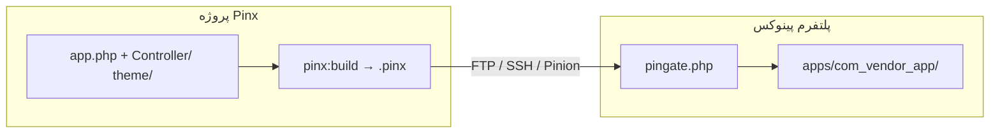

# دیپلوی اپ Pinx (فقط پکیج)

[← بازگشت به فهرست](../README.md)

این مسیر **تک‌اپ Pinx** است: فقط پکیج `.pinx` همین پروژه ساخته می‌شود، آپلود می‌شود و روی هاست **نصب یا به‌روزرسانی** می‌گردد.

کل پروژه (`platform/`، `vendor/`، `.env`، درخت سورس) فرستاده **نمی‌شود**.

مرجع کامل Pinroll (هاست، PinGate، provision، فلگ‌ها): [Pinroll — انتشار و دیپلوی](./pinroll.md)

---

## چه چیزی فرستاده می‌شود؟

| لایه | ارسال؟ |
|------|--------|
| `.pinx` همین اپ (کد + `dist/` تم) | **بله** — همیشه |
| پلتفرم هاست (`index.php`، `vendor/pinoox/pincore`، Manager) | خیر — از قبل روی هاست است |
| `platform/` لوکال، `bin/`، `.env`، `vendor/` | خیر — از `pinx build` حذف می‌شوند |
| zip پلتفرم (`--full` / `--platform`) | فقط اگر خودتان بخواهید |

روی هاست پکیج زیر `apps/{package}/` نصب یا آپدیت می‌شود. همان API منیجر → Applications (`pinx:install`).



---

## پیش‌نیاز

1. پروژه **Pinx** (`app.php` در ریشه — نه درخت چنداپه `apps/`).
2. **پلتفرم پینوکس در حال اجرا** روی هاست (Welcome + Manager). پوشه FTP خالی است؟ یک‌بار `pinx provision` بزنید، بعد به اینجا برگردید.
3. `pinoox/pinroll` روی **ماشین شما** (هاست به Pinroll داخل `vendor/` نیاز ندارد).

```bash
cd my-shop
composer require --dev pinoox/pinroll
pinx pinroll:init
```

---

## اتصال یک‌بار به هاست

یکی را انتخاب کنید:

| روش | کی | دستور |
|-----|-----|--------|
| **FTP** | هاست اشتراکی | `pinx connect --via=ftp` |
| **SSH** | VPS | `pinx connect --via=ssh` |
| **Zip kit** | فقط File Manager | `pinx kit` → استخراج در `public_html` |

```bash
pinx connect --via=ftp
pinx pinroll:check
```

کانفیگ (gitignore): `.pinoox/pinroll.config.php`. اختیاری: `PINROLL_*` در `.env` — **اولویت با Env است**. Pinroll فایل `.env` را خودکار پر یا بازنویسی نمی‌کند.

### اتصال فقط با Env

`PINROLL_TOKEN` می‌تواند plaintext هنگام ساخت توکن باشد، یا همان **`hash`** داخل `storage/pinroll/tokens/{label}.php` روی هاست:

```dotenv
PINROLL_TOKEN=b16f0a9d…   # hash از فایل yoose.php هم قبول است
PINROLL_LABEL=yoose
PINROLL_SITE=https://pinoox.com
PINROLL_VIA=pinion
PINROLL_PATH=public_html
```

اگر PinGate روی هاست قدیمی باشد و hash را رد کند، یک‌بار `pinx kit` بزنید و `pingate.php` را جایگزین کنید؛ بعد `pinx pinroll:check`.

```bash
pinx pinroll:check
pinx deploy
```

---

## دیپلوی / آپدیت همین پکیج

```bash
pinx deploy
```

همین حلقهٔ کامل است. Pinx:

1. پکیج **همین** `app.php` را هدف می‌گیرد (`--app=` خودش ست می‌شود).
2. اگر استک فرانت‌اند باشد `fe:build` می‌زند.
3. `pinx:build` → یک فایل `.pinx`.
4. همان فایل را آپلود می‌کند (نه کل پروژه).
5. از راه PinGate، `apps/{package}/` را نصب یا به‌روز می‌کند.

نسخه‌های بعدی همان دستور است. اگر نسخه را بالا ببرید:

```bash
pinx release --bump=patch
pinx deploy
```

اختیاری:

```bash
pinx deploy --check          # اول pinroll:check
pinx deploy --via=ftp
pinx deploy production
```

بعد از رسیدن فایل‌ها (migration / patch):

```bash
php pinoox pinroll:setup --app=com_acme_shop --skip-platform
```

---

## برای این مسیر استفاده نکنید

| دستور | چرا |
|-------|-----|
| `pinx deploy --full` | zip **پلتفرم** + همه اپ‌ها را هم می‌فرستد. برای آپدیت هسته هاست است، نه رلیز روزمره اپ. |
| `pinx provision` | نصب اول هاست **خالی** (platform.zip + نصب‌کننده). آپدیت اپ نیست. |
| فقط `pinx build` | `.pinx` را لوکال می‌سازد. برای نصب روی هاست هنوز Pinroll (یا آپلود در Manager) لازم است. |

---

## هاست باید پلتفرم داشته باشد

نصب `.pinx` به pincore روی سرور نیاز دارد. ترتیب معمول بار اول:

```bash
pinx provision          # یک‌بار: پلتفرم + دیتابیس + ادمین
pinx deploy             # .pinx همین اپ → apps/{package}/
```

بعد در Manager دامنه (یا مسیر) را به این اپ وصل کنید.

---

## مرتبط

- [Pinroll — راهنمای سریع](../start/pinroll-quickstart.md)
- [Pinroll — مرجع کامل](./pinroll.md)
- [Pinx CLI](../start/pinx-cli.md)
- [ساخت و انتشار `.pinx`](../start/build-release.md)

---

[← بازگشت به فهرست](../README.md)
