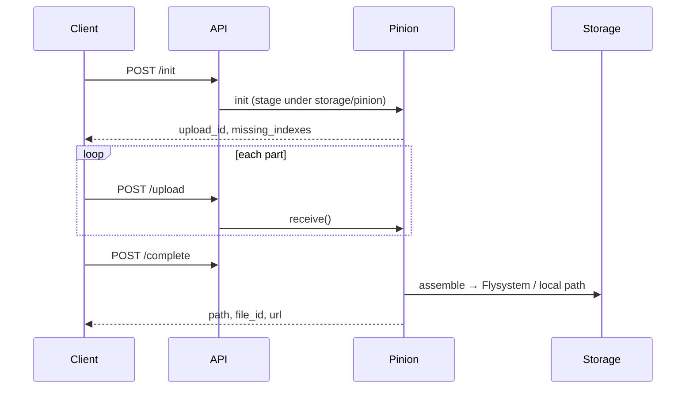

# Protocole Pinion

[← Retour à l'index](../README.md)

**Pinion** is the official Pinoox resumable chunked upload protocol. The engine lives in [`pinoox/pinion`](https://packagist.org/packages/pinoox/pinion) (PHP) and [`@pinooxhq/pinion-client`](https://www.npmjs.com/package/@pinooxhq/pinion-client) (browser). Pinoox adds a bridge: Portal, Flysystem/S3 integration, HTTP adapter, CLI, and HMVC traits.

Protocol id: `pinion` · version: `2`

> Framework-agnostic usage: [package README](../../pinion/README.md)

---

## Quick start

**Browser** (no Axios required):

```javascript
import { uploadFile } from '@pinooxhq/pinion-client';

await uploadFile(file, {
  baseURL: '/api/v1/upload',
  unwrapPreset: 'pinoox',
  onProgress: ({ percent }) => console.log(percent + '%'),
});
```

**Server** (per app):

```php
use Pinoox\Component\Pinion\Concerns\PinionUploadActions;
use Pinoox\Component\Kernel\Controller\ApiController;

class PinionController extends ApiController
{
    use PinionUploadActions;

    protected function pinionDefaults(): array
    {
        return [
            'destination' => 'uploads/media',
            'extensions' => ['mp4', 'zip'],
            'mode' => 'auto',
            'record' => true,
        ];
    }
}
```

Three HTTP steps: **init → upload parts → complete**.

---

## Why Pinion?

| Problem | Pinion solution |
|---------|-----------------|
| Host upload limit (e.g. 20 MB) | Upload 5 MB parts |
| Unstable connection | Resume by client `fingerprint` |
| Corrupted parts | Per-part `chunk_hash` (SHA-256) |
| Large files on S3 apps | Stage locally, publish to Flysystem on `complete` |

Pinion is **not** object storage. It solves PHP request-size limits, then hands off to [File management](./file-management.md) when `mode` is `auto` or `storage`.

---

## Architecture in Pinoox

| Layer | Location |
|-------|----------|
| Protocol engine | `packages/pinion` → `pinoox/pinion` |
| Bridge | `pincore/Component/Pinion/*` |
| Portal | `Pinoox\Portal\Pinion` |
| Config | `pincore/config/pinion.config.php` |
| Temp chunks | `pinion_uploads` → `storage/pinion` |
| Route template | `pincore/config/pinion.routes.template.php` |

### Storage modes (`defaults.mode`)

| Mode | Behaviour |
|------|-----------|
| `auto` | Use `Portal\File` / Flysystem when app `filesystem.disk` is not `local` (e.g. **S3**) |
| `storage` | Always publish through managed file storage + optional `FileModel` row |
| `local` | Assemble to project path via `path()` — no `pinx_file` row |

Chunks always stage under `storage/pinion`. On `complete` in managed mode, `StorageCompletion` streams the file to the app disk and returns `file_id`, `url`, `thumb`.

---

## Configuration

`pincore/config/pinion.config.php`:

```env
PINION_CHUNK_SIZE=5242880
PINION_TTL=86400
PINION_MAX_FILE=2147483648
PINION_PATH=~storage/pinion
PINION_STRATEGY=parts
PINION_VERIFY_CHUNKS=true
PINION_VERIFY_FILE=false
PINION_MODE=auto
```

| Key | Description |
|-----|-------------|
| `chunk_size` | Part size (clamped by min/max) |
| `ttl` | Session lifetime (seconds) |
| `max_file_size` | Maximum declared upload size |
| `storage_path` | Temp workspace for in-progress uploads |
| `storage_strategy` | `parts` (parallel) or `sparse` (single blob) |
| `verify_chunks` | Require SHA-256 `chunk_hash` per part |
| `defaults.mode` | `auto`, `storage`, or `local` |
| `defaults.record` | Create `FileModel` row on managed complete |

---

## HMVC controller (recommended)

Use `PinionUploadActions` in any app under `apps/{package}/`:

```php
use Pinoox\Component\Pinion\Concerns\PinionUploadActions;

class MediaUploadController extends ApiController
{
    use PinionUploadActions;

    protected function pinionDefaults(): array
    {
        return [
            'destination' => 'uploads/media',
            'extensions' => ['mp4', 'mov', 'webm'],
            'mode' => 'auto',
            'record' => true,
            'access' => 'public',
            'group' => 'media',
        ];
    }
}
```

**Local-only** (no Flysystem — e.g. manager `.pinx` packages):

```php
protected function pinionDefaults(): array
{
    return [
        'destination' => 'downloads/packages/manual',
        'extensions' => ['pinx'],
        'mode' => 'local',
        'storage' => false,
        'record' => false,
    ];
}
```

Register routes in `routes/api.php`:

```php
post(path: '/pinion/init', action: [PinionController::class, 'init']);
post(path: '/pinion/upload', action: [PinionController::class, 'upload']);
post(path: '/pinion/complete', action: [PinionController::class, 'complete']);
get(path: '/pinion/status/{uploadId}', action: [PinionController::class, 'status']);
post(path: '/pinion/abort/{uploadId}', action: [PinionController::class, 'abort']);
```

Client `baseURL` = route prefix only (e.g. `'/app/pinion'`, not a single `/upload` URL).

---

## Portal (programmatic)

```php
use Pinoox\Portal\Pinion;

$result = Pinion::begin()
    ->filename('backup-2026.zip')
    ->size(524288000)
    ->to('downloads/archives')
    ->extensions(['zip'])
    ->fingerprint($clientFingerprint)
    ->init();

Pinion::receive($uploadId, $index, $chunkBinary, $chunkHash);
$complete = Pinion::complete($uploadId);

Pinion::status($uploadId);
Pinion::abort($uploadId);
Pinion::cleanExpired();
$sessions = Pinion::list('pending');
```

---

## HTTP protocol

| Step | Method | Fields |
|------|--------|--------|
| Init / resume | `POST {prefix}/init` | `filename`, `size`, `fingerprint`, optional `destination`, `chunk_size`, `mime`, `extensions`, `meta` |
| Upload part | `POST {prefix}/upload` | `upload_id`, `index`, `chunk` (file), optional `chunk_hash` |
| Complete | `POST {prefix}/complete` | `upload_id`, optional `file_hash` |
| Status | `GET {prefix}/status/{id}` | `missing_indexes`, `progress` |
| Abort | `POST {prefix}/abort/{id}` | — |

### Managed complete response

```json
{
  "session": { "id": "…", "filename": "video.mp4" },
  "path": "uploads/media/x7f2.mp4",
  "file_id": 42,
  "url": "https://cdn.example.com/…",
  "storage": true
}
```

---

## Browser client

npm: [`@pinooxhq/pinion-client`](https://www.npmjs.com/package/@pinooxhq/pinion-client)

| Level | API |
|-------|-----|
| Fastest | `uploadFile(file, { baseURL, unwrapPreset: 'pinoox' })` |
| Reusable | `pinion({ baseURL }).for(file).upload()` |
| Axios optional | `pinion(axios, { baseURL })` for per-chunk progress |

```javascript
import { pinion } from '@pinooxhq/pinion-client';

const uploader = pinion({
  baseURL: '/app/pinion',
  unwrapPreset: 'pinoox',
  destination: 'uploads/media',
});

await uploader.for(file).upload({
  parallel: 2,
  meta: { group: 'media' },
  onProgress: ({ percent, speed, eta }) => console.log(percent, speed, eta),
});
```

Full client guide: [client/README.md](../../pinion/client/README.md)

---

## CLI

```bash
php pinoox pinion:list
php pinoox pinion:list --status=pending --json
php pinoox pinion:info {upload_id}
php pinoox pinion:clean
php pinoox pinion:clean --abort={upload_id}
```

Single-app projects — same commands via [Pinx CLI](../start/pinx-cli.md):

```bash
pinx pinion:list
pinx pinion:info {upload_id}
pinx pinion:clean --abort={upload_id}
```

---

## Manager integration

`com_pinoox_manager` uses Pinion for large manual `.pinx` uploads:

| Endpoint | Action |
|----------|--------|
| `POST /app/pinion/init` | Start or resume |
| `POST /app/pinion/upload` | One part |
| `POST /app/pinion/complete` | Assemble file |
| `GET /app/pinion/status/{uploadId}` | Progress |
| `POST /app/pinion/abort/{uploadId}` | Cancel |

Frontend: `theme/spark/src/utils/pinion.js` — threshold 8 MB, parallel parts, SHA-256 hashes.

---

## Flow



---

## Related docs

- [File management](./file-management.md)
- [Package README](../../pinion/README.md)
- [Pinx CLI](../start/pinx-cli.md)
- [CLI reference](../start/cli-reference.md)

---

[← Back to index](../README.md)
